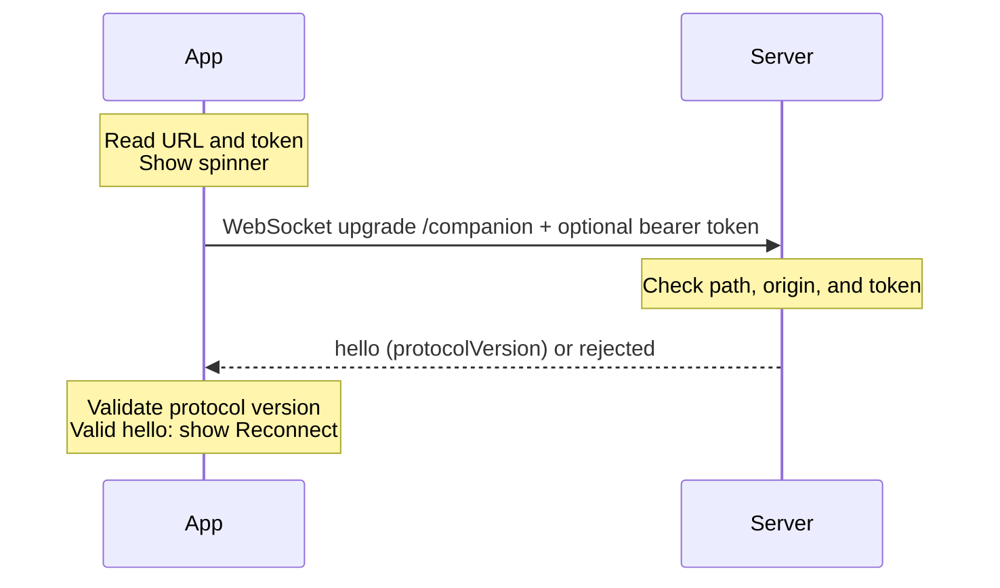

# Contributor Commands

- `python scripts/bootstrap.py | iex` (PowerShell): installs the expected Node.js version if it is missing or stale and activates it in the current shell.
- `eval "$(python scripts/bootstrap.py)"` (Linux/macOS): initializes and activates the same development environment in the current POSIX shell.
- Add `--force` before the pipe or inside the command substitution to replace the existing vendored Node.js directory.
- `npm install`: installs dependencies and downloads the Electron app binary via `postinstall`.
- `npm run dev`: starts the Electron/Vite development app.
- `npm run server`: builds and starts the companion; run it in a separate terminal from the app.
- `npm run server:dev`: runs the companion with file watching.
- `npm run build`: builds the app and companion into `out/`.
- `npm run build:server`: builds only the companion into `out/server/`.
- `npm run typecheck`: checks the app, companion, and tests.
- `npm test`: runs socket integration tests for connections, restarts, authentication, validation, timeouts, and cleanup.
- `npm run lint`: runs ESLint.
- `npm run lint:fix`: runs ESLint with auto-fixes.
- `npm run format`: formats files with Prettier.
- `npm run upgrade`: upgrades dependencies to the latest peer-compatible versions, pins exact versions, and runs `npm install`.

## Server Deployment

Copy all of `out/server/` to a Node.js 22.22.3+ environment, then run `npm install --omit=dev` and `npm start` there. Its generated manifest includes only the pinned `ws` dependency.

# Architecture

- Keep direct dependencies pinned to exact versions in `package.json`.
- Use `npm run upgrade` instead of manually editing version ranges when updating dependencies.
- Keep contributor facing information in `AGENTS.md`. Keep `README.md` focused on end-user instructions. Keep both short and easy to understand.

## Codebase Layout

- `src/main/`: Electron main process. Owns app lifecycle, window creation, and privileged OS/Electron work.
- `src/preload/`: secure bridge loaded before the renderer. Expose only narrow renderer APIs with `contextBridge`.
- `src/renderer/`: React/browser UI. Treat this as unprivileged browser code; do not rely on Node APIs here.
- `src/server/server.ts`: standalone server lifecycle and command dispatch.
- `src/shared/companion.ts`: protocol types, message validation, and preload API contract. Update this when adding commands.
- `src/main/companion-client.ts`: networking, request tracking, and reconnect logic; testable without Electron.

## Server Endpoints

The server listens on `127.0.0.1:4317` by default. Override with `ADE_COMPANION_HOST` and `ADE_COMPANION_PORT`.

| Endpoint               | Description                                                                            |
| ---------------------- | -------------------------------------------------------------------------------------- |
| `GET /health`          | Public liveness check. Returns JSON: `name: "ade-companion"` and `protocolVersion: 1`. |
| WebSocket `/companion` | Persistent connection for app commands and server messages.                            |

If `ADE_COMPANION_TOKEN` is set, WebSocket clients must send `Authorization: Bearer <token>`; missing or wrong tokens return 401. WebSocket requests with an `Origin` header return 403; unknown paths return 404. Main handles the token; the renderer never receives it. Remote deployments need a token and a TLS reverse proxy.

## WebSocket Commands

Send JSON text over `/companion`, up to 16 KiB per message. Each message has a `type`, for example `{"type":"ping","id":"1"}`.

| Command | Fields | Purpose                                                   |
| ------- | ------ | --------------------------------------------------------- |
| `ping`  | `id`   | Check responsiveness. Receives `pong` with the same `id`. |

`ping` is currently the only command. Use a unique `id` string of 1–128 characters per request. The app client times out after five seconds.

### Server Messages

| Type    | Fields            | Description                                        |
| ------- | ----------------- | -------------------------------------------------- |
| `hello` | `protocolVersion` | Sent on connection. Current protocol version: `1`. |
| `pong`  | `id`              | Reply to a JSON `ping`.                            |
| `error` | `message`         | Explains an invalid or unsupported command.        |

Automatic heartbeats use WebSocket ping/pong control frames.

## Startup

The app uses `ADE_COMPANION_URL`, defaulting to `ws://127.0.0.1:4317/companion`.

On failure, timeout, or invalid `hello`, retry with a delay increasing from 500 ms to 10 s until connected.

## Steady State

The app sends a WebSocket ping every 10 s, and the server every 30 s. Each replies with pong. A lost connection returns to startup with backoff.
