# Contributor Commands

- `python scripts/bootstrap.py | iex` (PowerShell) or `eval "$(python scripts/bootstrap.py)"` (POSIX): install and activate the expected Node.js version. Add `--force` to replace the vendored installation.
- `npm install`: install dependencies and the Electron binary.
- `npm run dev`: start Electron/Vite.
- `npm run server`: build and start the companion in a separate terminal. Append `-- --config path/to/server.yaml` to select a config.
- `npm run server:dev`: run the companion with file watching; accepts the same config argument.
- `npm run build` / `npm run build:server`: build everything / just the companion into `out/`.
- `npm run typecheck`: check app, companion, and tests.
- `npm test`: run socket and temporary Git repository integration tests. Git must be on PATH.
- Set `ADE_TEST_VSCODE_RUNTIME` to a VS Code web server distribution and run `npm run build` followed by `npm test` to also check the real editor window, worktree switching and restoration across desktop restarts.
- `npm run lint` / `npm run lint:fix`: check / fix ESLint issues.
- `npm run format`: format with Prettier.
- `npm run upgrade`: upgrade dependencies to the latest peer-compatible versions, pin them, and install.

## Server Deployment

The companion runs independently of the desktop app. Deploy its build to a machine with Git and a compatible Node.js runtime, install production dependencies, and supply the server configuration. Worktree paths refer to that machine's filesystem.

# Architecture

- Keep direct dependencies pinned to exact versions. Use `npm run upgrade` to update existing dependencies.
- Keep contributor information here and end-user instructions in `README.md`. Keep both short and easy to understand.
- Documentation guidelines:
  - Encode high-level design decisions and workflows here. Keep implementation details in the code.
  - Think about what a tech lead who is not very familiar with the codebase would need to know to make informed architectural decisions.
  - Keep only duration information; exclude non-durable information such as version.
  - Avoid enumeration; replace with the broader idea being referenced.
  - Workflow documentation guidelines:
    - Think about the important actions a user can take and workflows initiated by the server.
    - Use a mermaid sequence diagram with details where necessary. Start from the trigger and follow the automation to its natural end.
    - Avoid conditional branches in diagrams. Describe possible responses and their reactions on a single edge or note.
    - Document the endpoints and commands being called on the server.
    - Limit prose to what is not covered by the diagram.
- Delegate aggressively to well-maintained libraries, even when the current requirement is small or isolated. They usually handle edge cases better and give us a stronger base for future requirements.
- This project is still in development. Assume the server and client always run the same build.

## Codebase Layout

The desktop app separates presentation from privileged work. The renderer owns the UI, the main process owns connections and OS access, and preload provides a narrow bridge between them. The companion credential stays in the main process. App-owned UI components wrap the component library so it can be replaced without rewriting features.

The companion server owns configuration, Git operations, and the shared view of worktrees. Git is the source of truth; the server keeps a cache so listing is fast. Changes and refreshes run in order so concurrent clients see consistent results.

Every accepted Git worktree list follows one application path: reconcile editor processes against the complete list, then publish the resulting state. Project scans first merge with other projects' cached worktrees. Editor-status broadcasts do not change membership or trigger reconciliation.

The shared layer defines the contract between the app and server. Library-backed schemas validate incoming data and provide the matching types. Keep both sides of the contract in step when behavior changes.

The companion owns a VS Code web server process per opened worktree. Stable workspace data directories retain editor state; all processes use the companion account's local VS Code extensions directory. Startup is registered in the worktree queue, then download and readiness waits run independently so Git operations remain responsive. Deletion and shutdown cancel pending starts. Processes live until deletion, failure or companion shutdown, independently of desktop connections. The main process owns a single editor window with retained views and persistent browser storage. Editor views have no preload bridge or Node access. The main process supplies editor request credentials without exposing them through the worktree picker's preload bridge. VS Code manages its own editor-page session cookie.

The picker window owns the desktop app's lifetime on every platform: closing it quits the app and closes all editor views. Closing only the editor window immediately hides its retained views while the picker stays open. Desktop shutdown prioritizes responsiveness and does not honor editor unload vetoes or wait for saves, backups or settings synchronization. Losing recent unsaved edits or unfinished backups is an accepted tradeoff. Companion processes keep running, but cannot preserve browser state that was never saved. The server must never hold the client open.

Each retained editor page owns its current navigation state throughout its lifetime. Opening reuses ready pages, waits for loading pages, and replaces failed pages; token rotation also replaces the page. Only the current navigation can complete readiness, and disposal belongs to the specific view being removed. Readiness depends on the main document, independently of subresources.

The active editor view and its extension frames may use the clipboard and microphone; clipboard reads require a user gesture. Other browser permission requests remain denied. VS Code and Chromium retain their frame-level policies, and operating-system microphone permissions still apply. The editor proxy replaces only the authentication cookie, preserving browser preferences such as display language.

## Connections

The app's main process opens a WebSocket connection directly at `/companion`, independently of loading any editor page, so the server can push changes to every connected app. The main process handles authentication and reconnection. When configured, it supplies `ADE_COMPANION_TOKEN` as a bearer token during the upgrade; the operator sets the same shared secret on the app and server. The server rejects browser connections to `/companion`, while editor pages use separate connections under `/editors/`. Remote deployments require authentication and encrypted transport.

Worktree commands return the current list in a `worktrees` reply. Changes and refreshes also broadcast `worktrees:updated` to all connected apps, including the requester. Failures return `error` without disconnecting the app. Message fields and validation rules live in the shared contract.

## Startup

The server loads and validates its configuration, then discovers worktrees for all configured projects. It accepts connections only after the cache is ready. On accepting a connection, the server sends `hello` without waiting for a command. The app checks compatibility before requesting the cached list with `worktrees:list`.

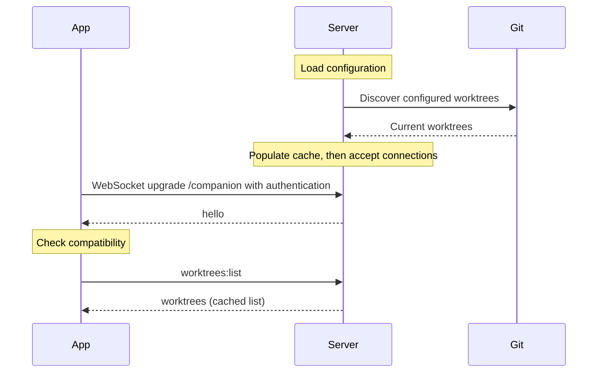

## Steady State

The app and server independently initiate background heartbeats on `/companion`. Each peer automatically answers WebSocket ping control frames with pong. The server closes unresponsive connections; the app retries lost connections and reloads the list after reconnecting.

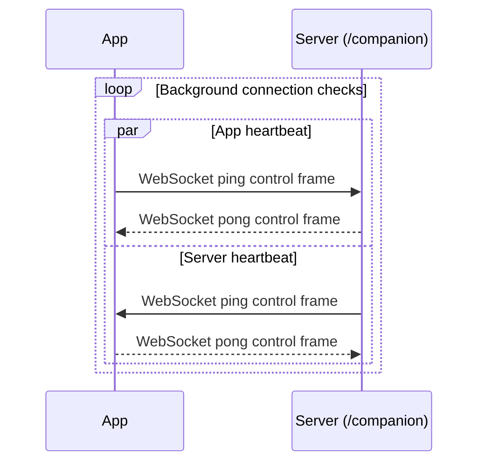

## Worktree Updates

When an operation changes the cached Git state or a refresh completes, the server initiates a `worktrees:updated` broadcast on `/companion`. Every connected app receives the current list without polling, including the app that requested the operation. Apps use the newest update and ignore older responses. An app that missed updates while disconnected recovers through `worktrees:list` after reconnecting; both recovered lists and broadcasts close retained views for removed worktrees. External Git changes become visible when a user refreshes.

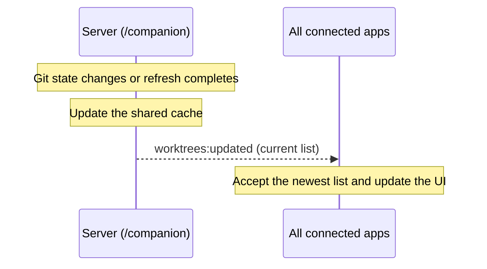

## Create Worktree

The user chooses a project, base branch, and path, then the app sends `worktrees:create`. A new branch name is optional; leaving it blank checks out the base branch directly. Git enforces its checkout rules. Creation can leave a worktree behind even when Git reports an error, so the server checks the actual Git state and shares any changes before returning the result. The app still shows the original error.

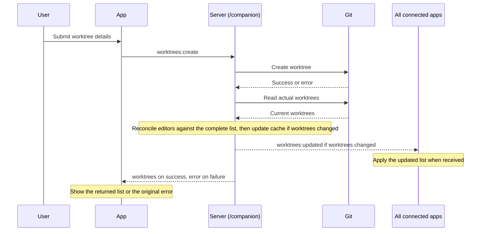

## Delete Worktree

The user confirms which worktree to remove, then the app sends `worktrees:delete`. The server protects main and locked worktrees, stops the worktree's editor, and asks Git to remove it safely. Git refuses removal when local changes would be lost. The branch and saved editor state are retained; an editor stopped for a failed deletion can be reopened.

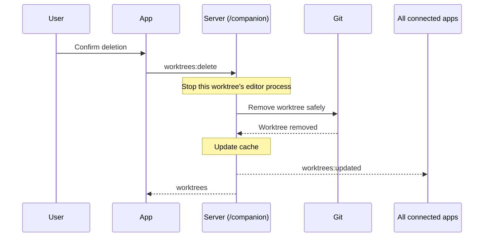

## Editor Updates

The companion requires an installed VS Code CLI on PATH. Runtime preparation uses Microsoft's downloader; direct editor launch exposes the reconnection grace and avoids the wrapper's idle shutdown. The internal layout, release log and launch arguments are validated before accepting a runtime. Prepared copies live outside the CLI's cache pruning; old copies are retained so live processes keep their files. Preparation runs independently of worktree operations and is cancelled on shutdown.

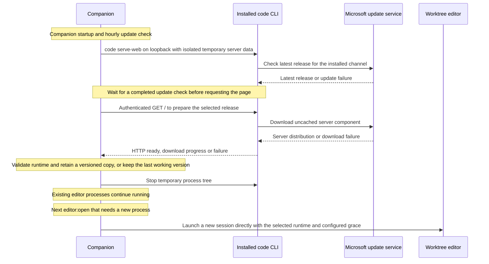

## Open Editor

Editor tokens are cryptographically random and separate from `ADE_COMPANION_TOKEN`; no Microsoft or GitHub login is required. Restarting an editor process rotates its token while retaining workspace data. The worktree picker and snapshots never receive editor tokens, and the companion shared secret is never forwarded to VS Code.

Switching to a retained view reuses its existing connections. User settings synchronize with the companion account's default desktop profile; keybindings initialize new browser profiles. Extension packages and the default registry are shared directly with the local VS Code installation. Saved workspace data stays separate from runtime versions.

Clients need only the companion's address; individual VS Code ports remain private to the server machine. Remote deployments must expose that address through TLS and forward both HTTP and WebSocket upgrades. Persistence comes from retained editor processes and saved state, independently of the proxy.

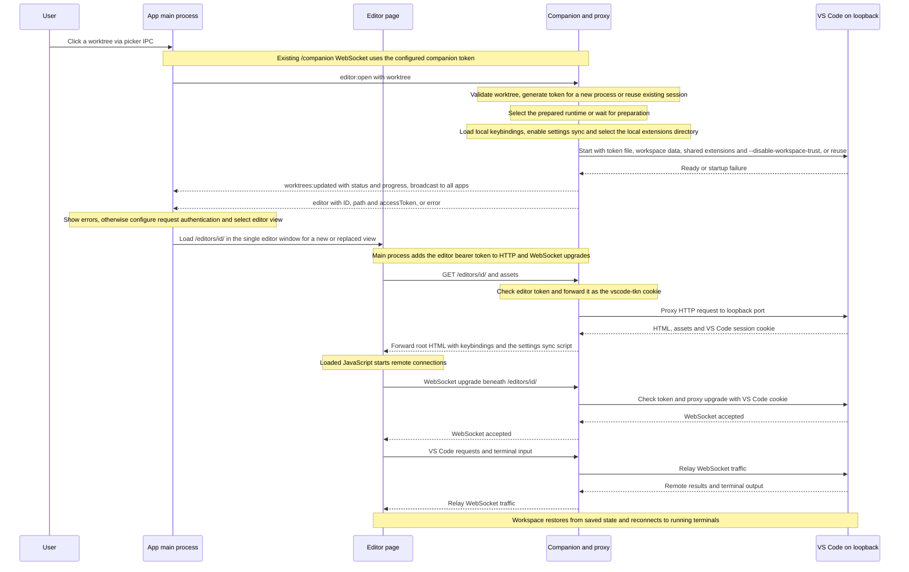

## Sync User Settings

Settings move, persist and compare as one immutable `SettingsSnapshot`: content and original modification time. Browser snapshots live in the app's persistent storage, shared by companion origin. Main owns one sync loop per companion origin, using a loaded view to access that storage; workspace query changes remain valid and another view can take over when one is unavailable. Views only observe saves and expose storage operations to main, without a preload or IPC bridge. A browser lock protects snapshots and replacements. Whole-file replacement uses wall-clock save times with approximate ordering across machines; equal times favor the companion. Copies retain the winning snapshot to avoid feedback. A new browser starts with the companion copy; subsequent pending saves survive app restarts. A reply applies only while the full browser snapshot still matches the one sent; intervening saves wait for the next cycle. Remote and Workspace overrides remain separate. Legacy imported Remote values migrate once, preserving edited values and a backup.

The bridge uses VS Code's IndexedDB store and file-change broadcast, checked by the real-editor integration test. These are internal runtime interfaces and must be revalidated when updating the runtime. Editor authentication protects both the script and the sync endpoint; the endpoint can only access the discovered local settings file.

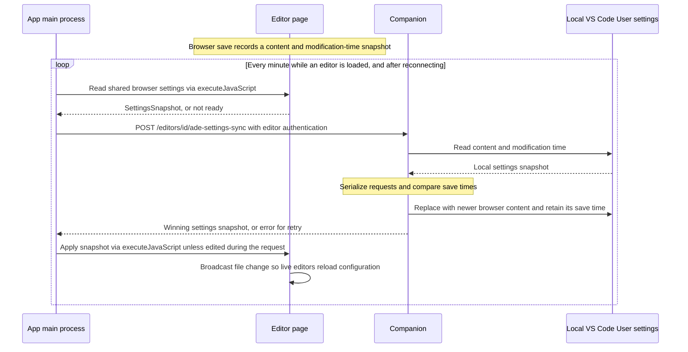

## Refresh Worktrees

The user refreshes to pick up changes made outside the app. `worktrees:refresh` rescans Git, while `worktrees:list` reads the cache. After a successful scan, the server replaces its cache and shares the updated list with all connected apps.

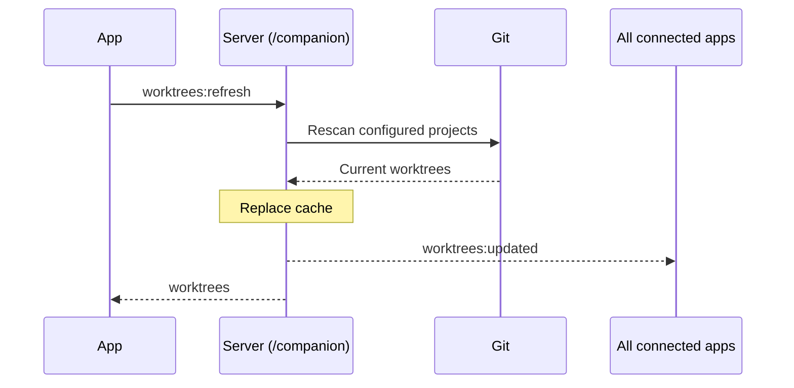

## Reconnect

The user can force a fresh connection. The main process replaces the existing connection and returns to the startup workflow, including reloading the worktree list. If the server is unavailable, automatic retries continue.

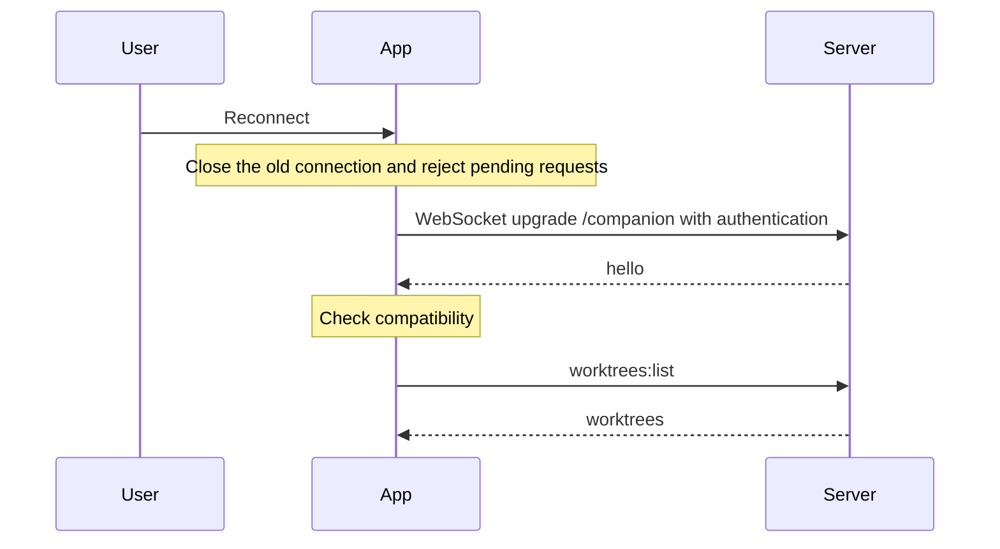

## Server Shutdown

When the server is stopped, it closes client connections, lets accepted operations finish, and stops its editor processes before exiting. Apps reject pending requests and return to automatic reconnection. Once the server is available again, the startup workflow reloads the list so apps can see the outcome of operations interrupted by the disconnect. Reopening a worktree starts its editor with the saved workspace data.

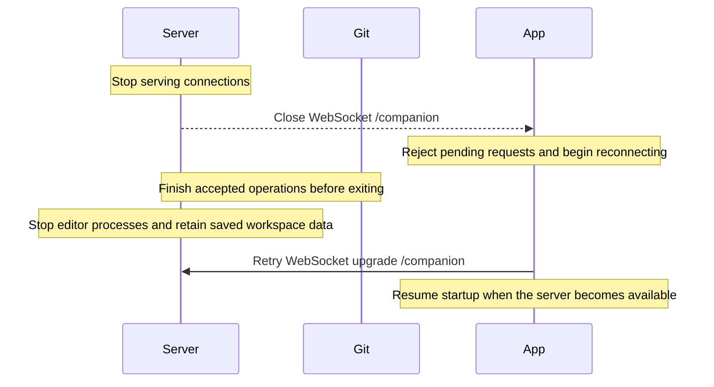
