# Contributor Commands

- `python scripts/bootstrap.py | iex` (PowerShell) or `eval "$(python scripts/bootstrap.py)"` (POSIX): set up the development environment by installing and activating Node.js and installing dependencies and Electron. Add `--force` to replace the vendored Node installation.
- `npm run dev`: start Electron/Vite.
- `npm run server`: build and start the companion in a separate terminal. Append `-- --config path/to/server.yaml` to select a config.
- `npm run server:dev`: run the companion with file watching; accepts the same config argument.
- `npm run build` / `npm run build:server`: build everything / just the companion into `out/`.
- `npm run build:extension`: package the workspace extension as `out/ade-terminals.vsix`.
- `npm run package`: build desktop installers and a companion archive for the host OS and architecture into `dist/`. Use the Node runtime pinned in `.node-version`. `npm run package:dir` skips desktop installers for local checks.
- `npm run test:package`: smoke-test the extracted companion without system Node, extension setup and desktop package contents after packaging.
- `npm run test:extension`: run isolated VS Code extension-host tests; set `ADE_TEST_VSCODE_EXECUTABLE` to an existing VS Code executable to avoid downloading a test runtime.
- `npm run typecheck`: check app, companion, and tests.
- `npm test`: run socket and temporary Git repository integration tests. Git must be on PATH.
- Set `ADE_TEST_VSCODE_RUNTIME` to a VS Code web server distribution and run `npm run build` followed by `npm test` to also check the real editor window, worktree switching and restoration across desktop restarts.
- `npm run lint` / `npm run lint:fix`: check / fix ESLint issues.
- `npm run format`: format with Prettier.
- `npm run upgrade`: upgrade dependencies to the latest peer-compatible versions, pin them, and install.

## Server Deployment

The companion runs independently of the desktop app. Release archives include Node, locked production dependencies and the matching VSIX. Extract to a stable path on a machine with Git and VS Code, supply the configuration, install the bundled extension and run the launcher under the repository owner's account. Worktree paths refer to that machine's filesystem.

## Packaging

Desktop and companion payloads are staged separately from the root lockfile. The desktop contains only its runtime dependencies; external companion scripts stay on disk for Node and VS Code to execute. The root package version drives all artifacts, including the VSIX. Upgrades are manual and coordinated because restarting the companion stops its editors. Persistent state stays outside installation directories, with a stable desktop application-data identity.

The Package workflow builds and checks native artifacts on Windows, Linux and both Mac architectures. Manual runs can produce unsigned test builds; version tags must match `package.json` and require desktop signing on Windows and signing/notarization on macOS. Set `WINDOWS_CSC_LINK` / `WINDOWS_CSC_KEY_PASSWORD`, `MAC_CSC_LINK` / `MAC_CSC_KEY_PASSWORD`, and `APPLE_ID` / `APPLE_APP_SPECIFIC_PASSWORD` / `APPLE_TEAM_ID` as Actions secrets. Local builds use electron-builder's `CSC_LINK` and `CSC_KEY_PASSWORD` variables; `ADE_REQUIRE_SIGNING=true` enforces release signing. Workflow artifacts are uploaded for review, not automatically published. Verify VS Code Server usage and redistribution terms before a public release; its binaries are downloaded by the installed CLI and are not included in our packages.

# Architecture

- Keep direct dependencies pinned to exact versions. Use `npm run upgrade` to update existing dependencies.
- Keep contributor information here and end-user instructions in `README.md`. Keep both short and easy to understand.
- Documentation guidelines:
  - Encode high-level design decisions and workflows here. Keep implementation details in the code.
  - Think about what a tech lead who is not very familiar with the codebase would need to know to make informed architectural decisions.
  - Keep only duration information; exclude non-durable information such as version.
  - Avoid enumeration; replace with the broader idea being referenced.
  - Workflow documentation guidelines:
    - Think about the important actions a user can take and workflows initiated by the server.
    - Use a mermaid sequence diagram with details where necessary. Start from the trigger and follow the automation to its natural end.
    - Avoid conditional branches in diagrams. Describe possible responses and their reactions on a single edge or note.
    - Document the endpoints and commands being called on the server.
    - Limit prose to what is not covered by the diagram.
- Delegate aggressively to well-maintained libraries, even when the current requirement is small or isolated. They usually handle edge cases better and give us a stronger base for future requirements.
- This project is still in development. Assume the server and client always run the same build.

## Codebase Layout

The desktop app separates presentation from privileged work. The renderer owns the UI, the main process owns connections and OS access, and preload provides a narrow bridge between them. The companion credential stays in the main process. App-owned UI components wrap the component library so it can be replaced without rewriting features.

The companion server owns configuration, Git operations, and the shared view of worktrees. Git is the source of truth for membership; the server keeps a cache so listing is fast. Pending operations and per-worktree errors are a server-owned overlay, included in snapshots and retained across desktop reconnects. Status precedence is pending operation, retained error, then editor running or stopped. Opening an editor preserves row errors until explicitly cleared. Synthetic creation rows never participate in editor reconciliation. Clearing an error removes a synthetic row only when Git has no corresponding worktree. Changes and refreshes run in order so concurrent clients see consistent results.

Every accepted Git worktree list follows one application path: reconcile editor processes against the complete list, then publish the resulting state. Project scans first merge with other projects' cached worktrees. Editor-status broadcasts do not change membership or trigger reconciliation.

The shared layer defines the contract between the app and server. Library-backed schemas validate incoming data and provide the matching types. Keep both sides of the contract in step when behavior changes.

The companion owns a VS Code web server process per opened worktree. Stable workspace data directories retain editor state; all processes use the companion account's local VS Code extensions directory. Startup is registered in the worktree queue, then download and readiness waits run independently so Git operations remain responsive. Deletion and shutdown cancel pending starts. Processes live until deletion, failure or companion shutdown, independently of desktop connections. The main process owns a single editor window with retained views and persistent browser storage. Editor views have no preload bridge or Node access. The main process supplies editor request credentials without exposing them through the worktree picker's preload bridge. VS Code manages its own editor-page session cookie.

The picker window owns the desktop app's lifetime on every platform: closing it quits the app and closes all editor views. Closing only the editor window immediately hides its retained views while the picker stays open. Desktop shutdown prioritizes responsiveness and does not honor editor unload vetoes or wait for saves, backups or settings synchronization. Losing recent unsaved edits or unfinished backups is an accepted tradeoff. Companion processes keep running, but cannot preserve browser state that was never saved. The server must never hold the client open.

Each retained editor page owns its current navigation state throughout its lifetime. Opening reuses ready pages, waits for loading pages, and replaces failed pages; token rotation also replaces the page. Only the current navigation can complete readiness, and disposal belongs to the specific view being removed. Readiness depends on the main document, independently of subresources.

The active editor view and its extension frames may use the clipboard and microphone; clipboard reads require a user gesture. Other browser permission requests remain denied. VS Code and Chromium retain their frame-level policies, and operating-system microphone permissions still apply. The editor proxy replaces only the authentication cookie, preserving browser preferences such as display language.

## Terminal Launcher Extension

The workspace extension in `extensions/ade-terminals` runs on the companion through its shared local extensions directory. Its sidebar webview reuses the main window's app-owned theme and UI components. A narrow validated message bridge accepts launch, provider selection and chat navigation actions; credentials remain in the extension host. Provider selection persists in extension global state. Provider terminals share a locked group remembered only during the current activation; ordinary terminals use VS Code's placement around locked groups and leave their destination unlocked for files. Empty groups are reused, and a single chat group fills the editor until ordinary content needs a separate group. Launches run sequentially because group focus is global workbench state. VS Code owns terminal titles and persistence. Activation does not adopt existing terminal groups or clean them up, and deactivation does not dispose terminals. Group locking governs default placement; users can still move tabs, rename terminals, and unlock groups.

```mermaid
sequenceDiagram
    participant User
    participant Extension as Workspace extension
    participant VSCode as VS Code workbench
    participant Shell as Companion shell
    User->>Extension: Sidebar launch action for Terminal or selected provider
    Note over Extension: Keep buttons available; queue launches and incoming terminal focus together
    Extension->>VSCode: Reuse an existing or empty group, creating a separate group only when needed
    Extension->>VSCode: createTerminal in editor area with workspace cwd and explicit chat viewColumn
    Note over Extension,VSCode: Lock provider group and unlock ordinary terminal group
    VSCode->>Shell: Start the configured default shell
    Extension->>Shell: sendText with configured foreground provider command and shell-owned exit
    Note over VSCode,Shell: Workspace session retains terminals independently of extension activation
    Shell->>VSCode: Exit when provider command finishes; close its terminal
```

## Live Chats

Provider adapters own hook configuration, payload mapping, process identification and conversation content. The companion merges its owned commands into global provider hooks under a file lock with atomic replacement; unrelated configuration is preserved. Reporters are bounded and fail quietly, identify the provider through local process ancestry, and send identity, activity and bounded message previews. Normal local CLIs remain unchanged.

Conversation titles are independent of terminal names. Codex previews come from prompt-submission and turn-end hooks; hooks without text preserve the last received message. The companion reads Codex resume titles from local metadata without writing it, honoring the provider home and database configuration. This internal metadata interface must be revalidated when Codex changes; unavailable content shows skeletons. Title refresh runs outside activity processing and retries during reconciliation. No historical transcript content is loaded. The extension forwards snapshots to its webview as plain text data and sends the latest state whenever the view becomes ready.

The companion owns an in-memory registry with only idle and working activity. Activity reports upsert chats; a later conversation replaces the entry for its terminal. Snapshots sort newest prompt or turn end first; tool activity and metadata refresh never reorder chats. Chats without an observed turn stay below those with one, with stable ties. Chat selection follows the active tab in the launcher's owned chat group, independently of focus in other groups. The launcher associates newly created chat tabs with terminal objects; the controller resolves them through validated local identities. Files in the owned group and group closure clear selection. Selection is local and never adopts layout groups across activations. All terminated-chat removal belongs to periodic process reconciliation using PID and start identity. Quiet idle chats never expire, and transport disconnection never changes their activity. Provider hook gaps are accepted; no remote provider observation supplements them.

Each editor gets separate activity and extension-control credentials for a dedicated authenticated loopback service. Terminals receive only the activity credential and an opaque terminal ID. The extension persists shell PID/start identity associations to recover restored terminals without adopting their layout groups. A new extension activation replaces stale control connections. Companion restart resets the registry; crash-survivor recovery is outside this lifecycle.

Process validation shares snapshots across queued requests only when the scan began after those requests arrived. Activity bursts share scan costs with terminal registration while registry updates retain their request order.

Control credentials reach the editor bootstrap over private IPC and are injected only when VS Code forks an extension host. The server and terminal environment never contain them. This startup interface must be revalidated against real native terminals and tasks when updating the runtime.

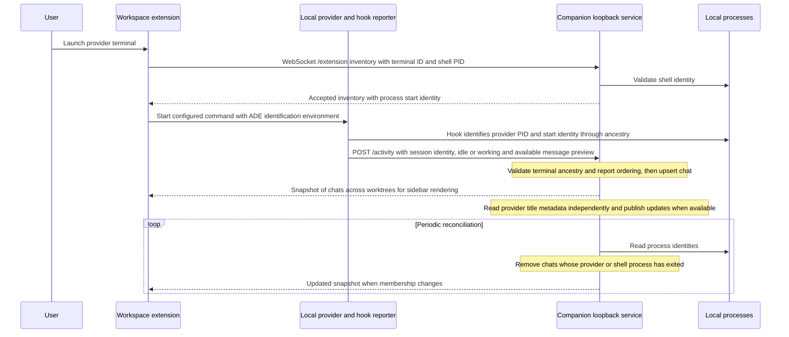

Navigation targets the single connected desktop; ambiguous routing is rejected. The desktop selects its retained editor view or loads the worktree. Fresh pages must have a new destination extension activation before focus is dispatched. The companion owns navigation through terminal acknowledgement and notifies its desktop when it finishes. Completion invalidates pending desktop opens without stopping shared editor startup or retained pages. Requests have bounded waits, acknowledgements and supersession cancellation; stale connections cannot complete them.

Each served editor document records the activation it supersedes. Chat navigation keeps that baseline across repeated opens and waits for a different activation with the destination terminal in its inventory. Reloading replaces the baseline; retaining the document preserves it.

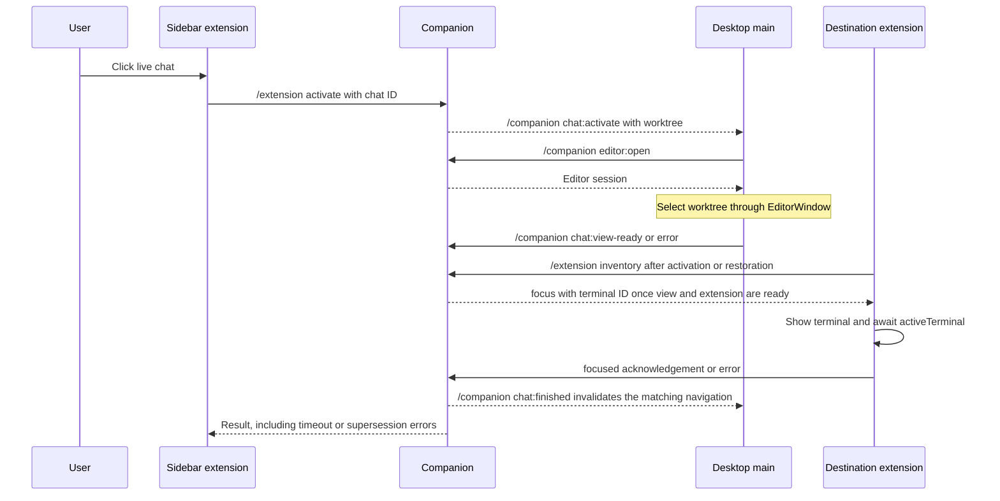

## Connections

The app's main process opens a WebSocket connection directly at `/companion`, independently of loading any editor page, so the server can push changes to every connected app. The main process handles authentication and reconnection. When configured, it supplies `ADE_COMPANION_TOKEN` as a bearer token during the upgrade; the operator sets the same shared secret on the app and server. The server rejects browser connections to `/companion`, while editor pages use separate connections under `/editors/`. Remote deployments require authentication and encrypted transport.

Worktree commands return the current list in a `worktrees` reply. Creation and deletion acknowledge acceptance before queued work runs; completion and failures arrive in snapshots. `worktrees:set-error` reports editor-page failures or clears a row error for every client. Changes and refreshes also broadcast `worktrees:updated` to all connected apps, including the requester. Rejected commands return `error` without disconnecting the app. Message fields and validation rules live in the shared contract.

## Startup

The server loads and validates its configuration, then discovers worktrees for all configured projects. It accepts connections only after the cache is ready. On accepting a connection, the server sends `hello` without waiting for a command. The app checks compatibility before requesting the cached list with `worktrees:list`.

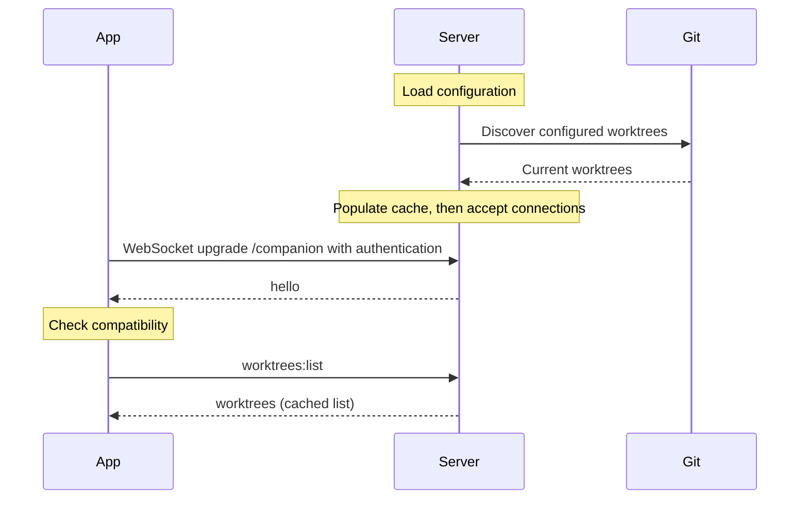

## Steady State

The app and server independently initiate background heartbeats on `/companion`. Each peer automatically answers WebSocket ping control frames with pong. The server closes unresponsive connections; the app retries lost connections and reloads the list after reconnecting.

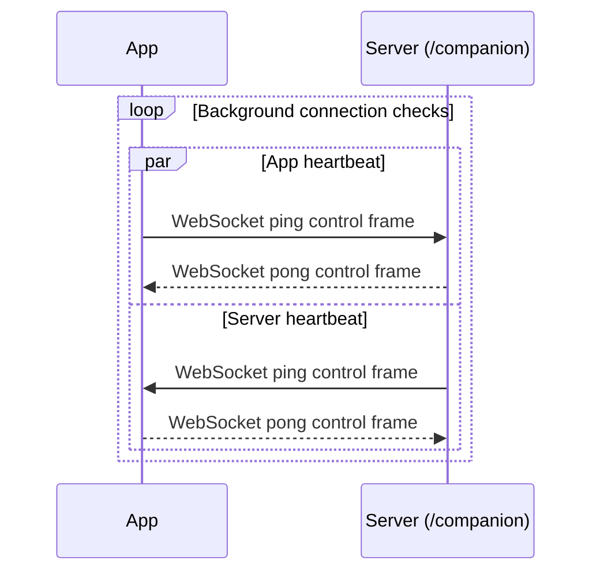

## Worktree Updates

When an operation changes the cached Git state or a refresh completes, the server initiates a `worktrees:updated` broadcast on `/companion`. Every connected app receives the current list without polling, including the app that requested the operation. Apps use the newest update and ignore older responses. An app that missed updates while disconnected recovers through `worktrees:list` after reconnecting; both recovered lists and broadcasts close retained views for removed worktrees. External Git changes become visible when a user refreshes.

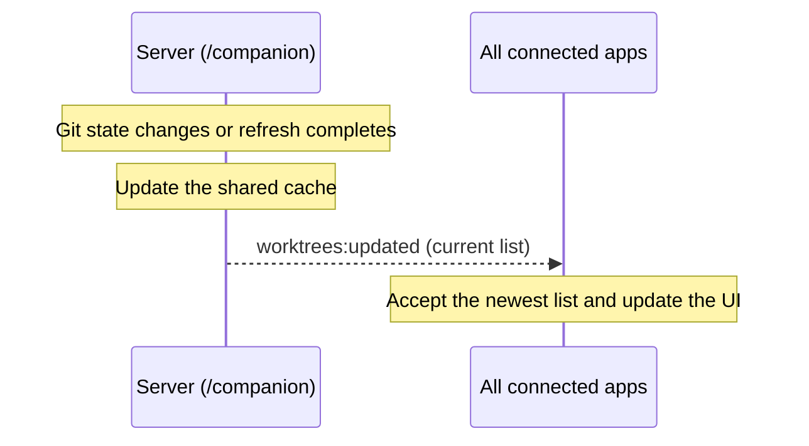

## Create Worktree

The server config uses project objects with `mainWorktreePath` and an optional `bootstrapCommand`. Bootstrap runs in the newly created directory under the companion account's default shell, inside the creation operation. The queue and its status belong to the server, independently of desktop connections. Failed checkouts or bootstrap commands can leave real worktrees behind; reconciliation preserves these and the original error.

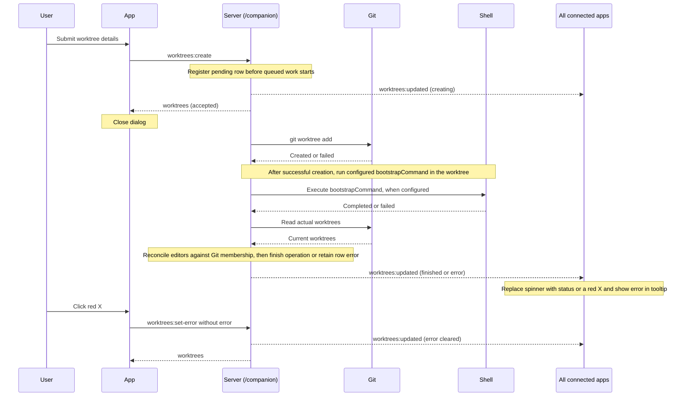

## Delete Worktree

Main and locked worktrees are protected. Removal never forces Git or deletes the branch or saved editor state. An editor stopped for a failed deletion can be reopened. Admission failures leave the confirmation dialog available; accepted operations release it immediately.

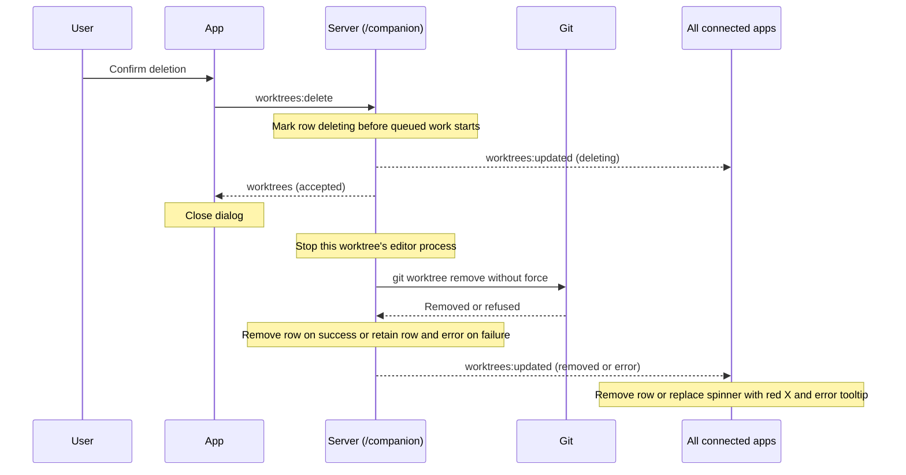

## Editor Updates

The companion requires an installed VS Code CLI on PATH. Runtime preparation uses Microsoft's downloader; direct editor launch exposes the reconnection grace and avoids the wrapper's idle shutdown. The internal layout, release log and launch arguments are validated before accepting a runtime. Prepared copies live outside the CLI's cache pruning; old copies are retained so live processes keep their files. ADE preserves mouse-report encoding in the bundled terminal serializer so interactive apps reconnect correctly. Compatibility revisions use separate runtime copies and must pass round-trip checks against the bundled terminal libraries before use. Preparation runs independently of worktree operations and is cancelled on shutdown.

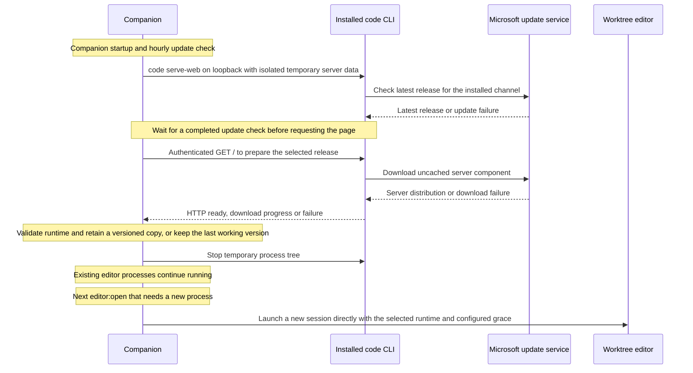

## Open Editor

Editor tokens are cryptographically random and separate from `ADE_COMPANION_TOKEN`; no Microsoft or GitHub login is required. Restarting an editor process rotates its token while retaining workspace data. The worktree picker and snapshots never receive editor tokens, and the companion shared secret is never forwarded to VS Code.

Switching to a retained view reuses its existing connections. User settings synchronize with the companion account's default desktop profile; keybindings initialize new browser profiles. Extension packages and the default registry are shared directly with the local VS Code installation. Saved workspace data stays separate from runtime versions.

Clients need only the companion's address; individual VS Code ports remain private to the server machine. Remote deployments must expose that address through TLS and forward both HTTP and WebSocket upgrades. Persistence comes from retained editor processes and saved state, independently of the proxy.

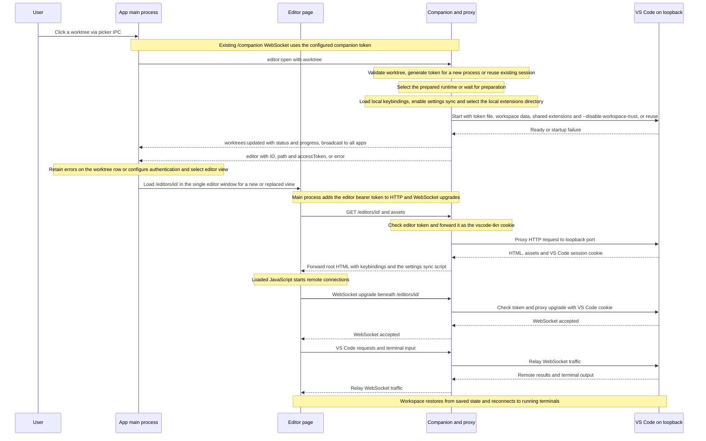

## Sync User Settings

Settings move, persist and compare as one immutable `SettingsSnapshot`: content and original modification time. Browser snapshots live in the app's persistent storage, shared by companion origin. Main owns one sync loop per companion origin, using a loaded view to access that storage; workspace query changes remain valid and another view can take over when one is unavailable. Views only observe saves and expose storage operations to main, without a preload or IPC bridge. A browser lock protects snapshots and replacements. Whole-file replacement uses wall-clock save times with approximate ordering across machines; equal times favor the companion. Copies retain the winning snapshot to avoid feedback. A new browser starts with the companion copy; subsequent pending saves survive app restarts. A reply applies only while the full browser snapshot still matches the one sent; intervening saves wait for the next cycle. Remote and Workspace overrides remain separate. Each editor server starts with terminal persistence enabled in its Remote settings so desktop reconnects can retain live processes, without changing synchronized User settings. Legacy imported Remote values migrate once, preserving edited values and a backup.

The bridge uses VS Code's IndexedDB store and file-change broadcast, checked by the real-editor integration test. These are internal runtime interfaces and must be revalidated when updating the runtime. Editor authentication protects both the script and the sync endpoint; the endpoint can only access the discovered local settings file.

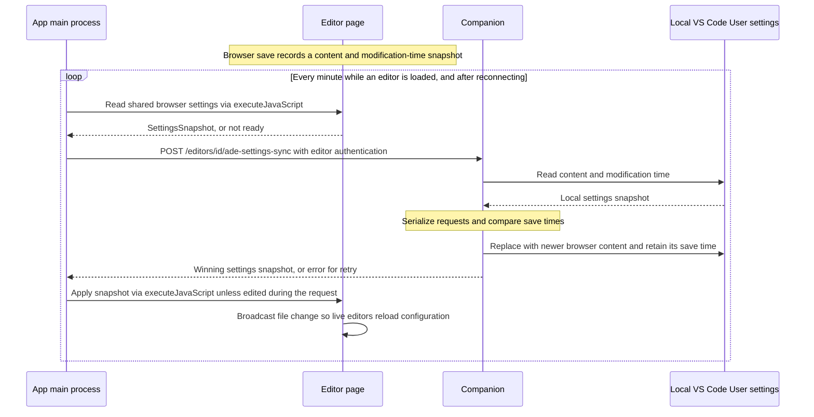

## Refresh Worktrees

The user refreshes to pick up changes made outside the app. `worktrees:refresh` rescans Git, while `worktrees:list` reads the cache. After a successful scan, the server replaces its cache and shares the updated list with all connected apps.

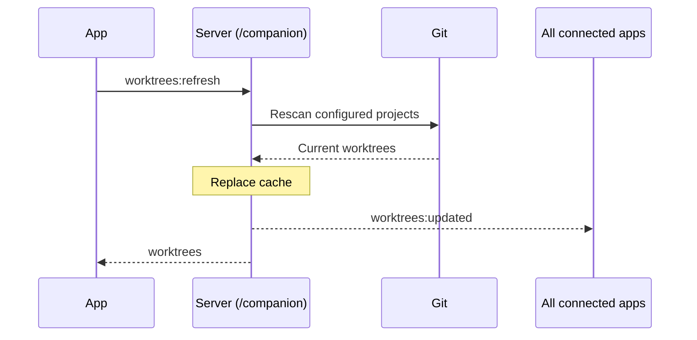

## Reconnect

The user can force a fresh connection. The main process replaces the existing connection and returns to the startup workflow, including reloading the worktree list. If the server is unavailable, automatic retries continue.

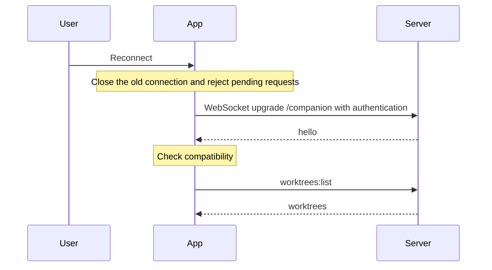

## Server Shutdown

When the server is stopped, it closes client connections, lets accepted operations finish, and stops its editor processes before exiting. Apps reject pending requests and return to automatic reconnection. Once the server is available again, the startup workflow reloads the list so apps can see the outcome of operations interrupted by the disconnect. Reopening a worktree starts its editor with the saved workspace data.

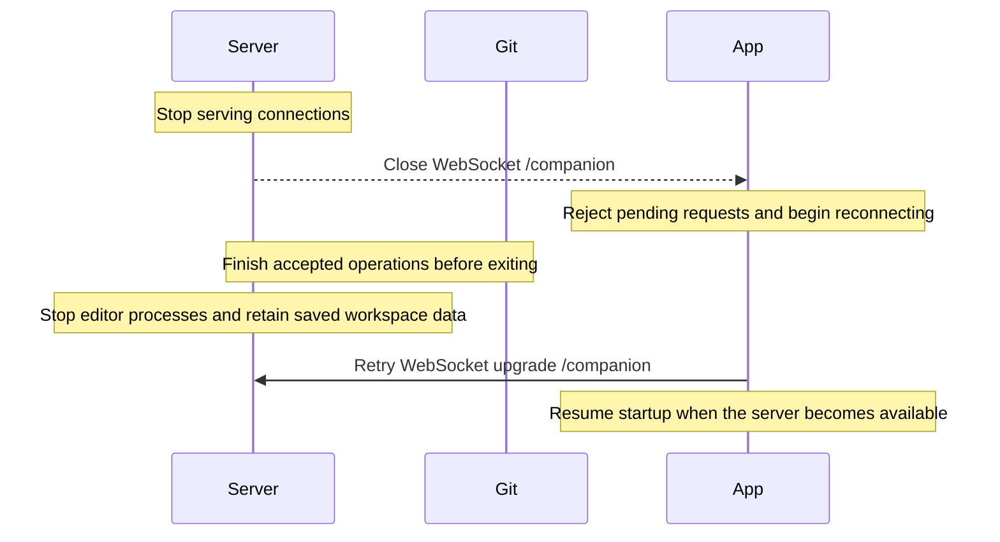
