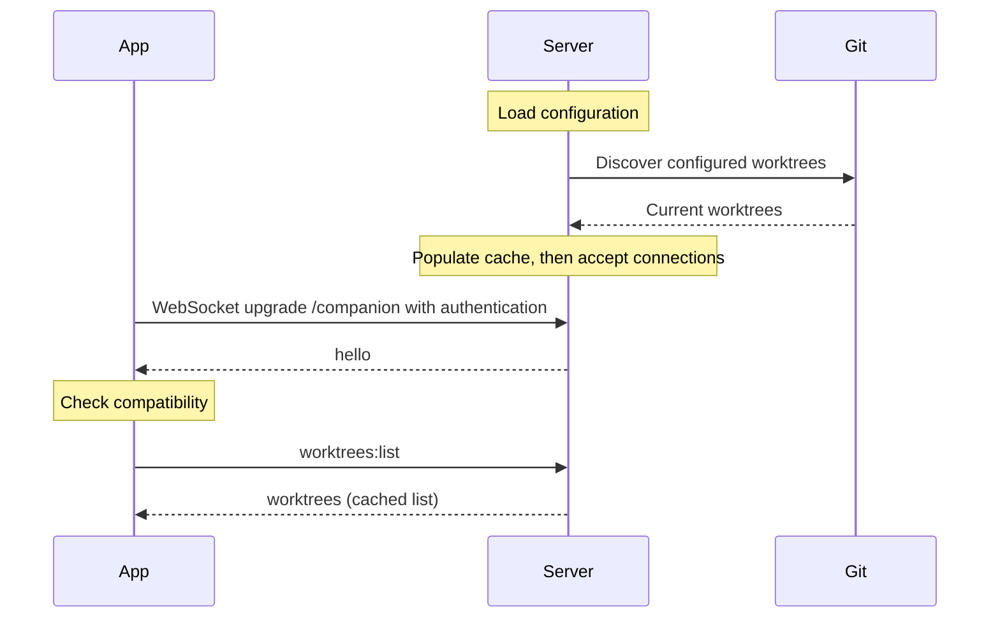
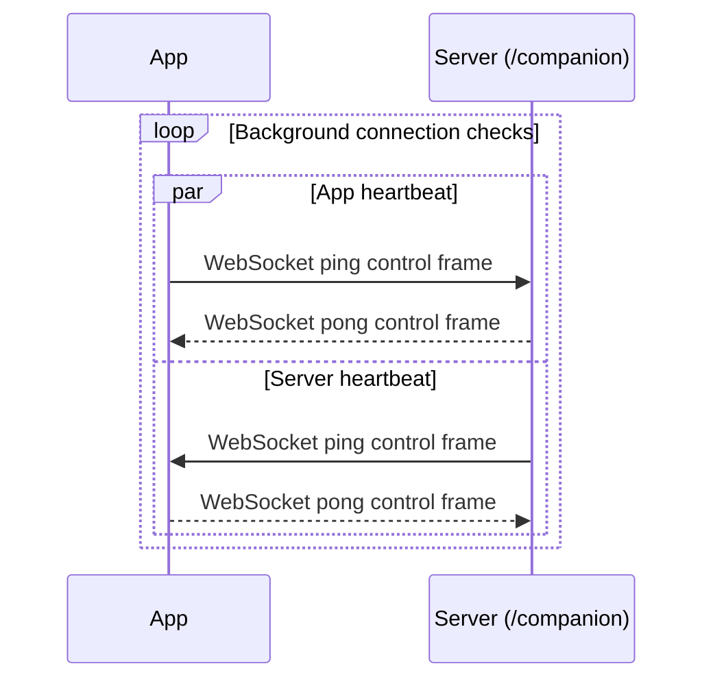
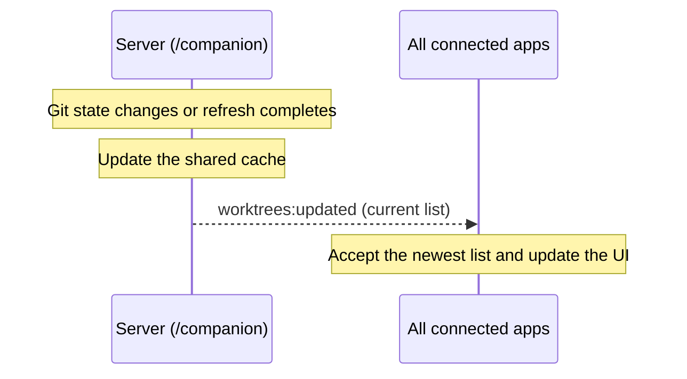
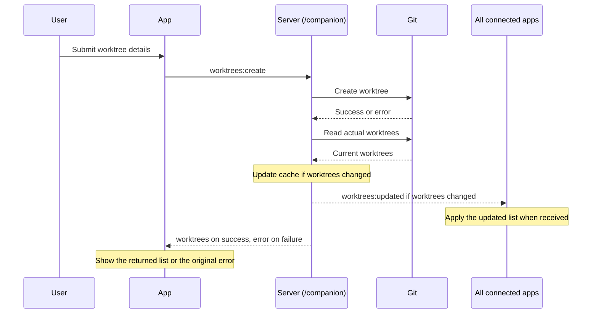
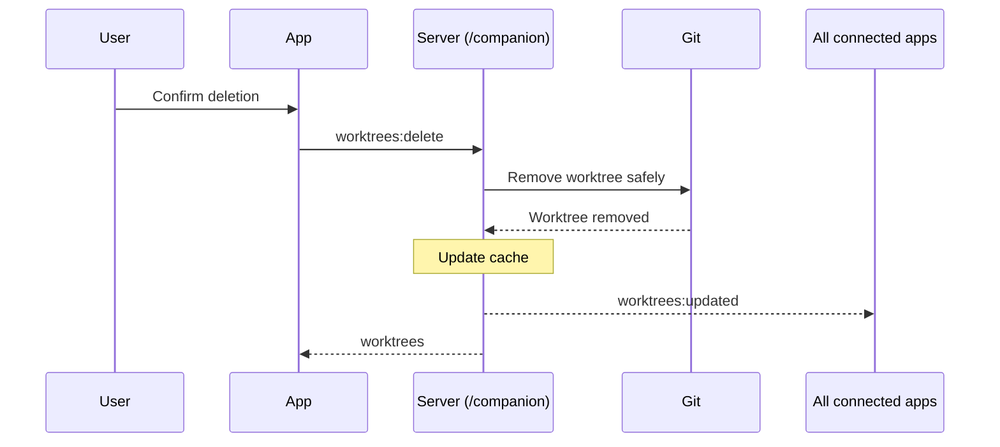
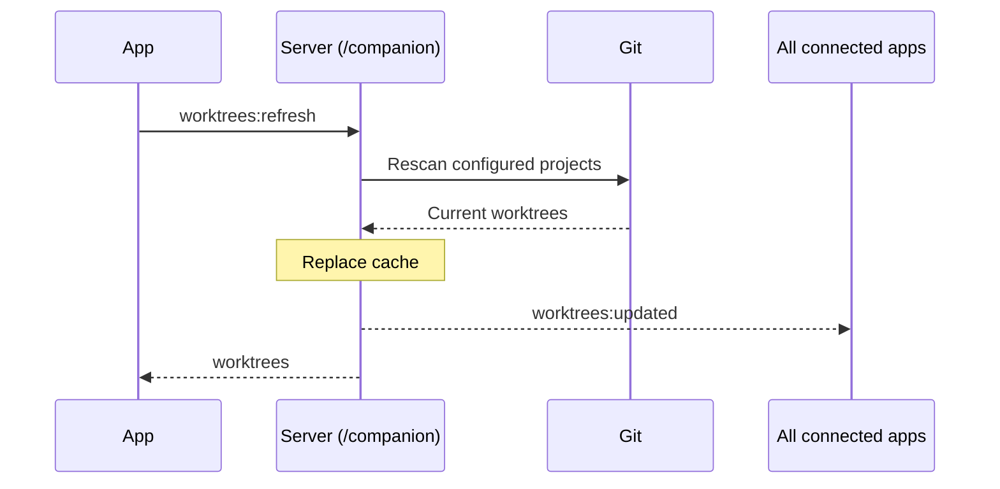
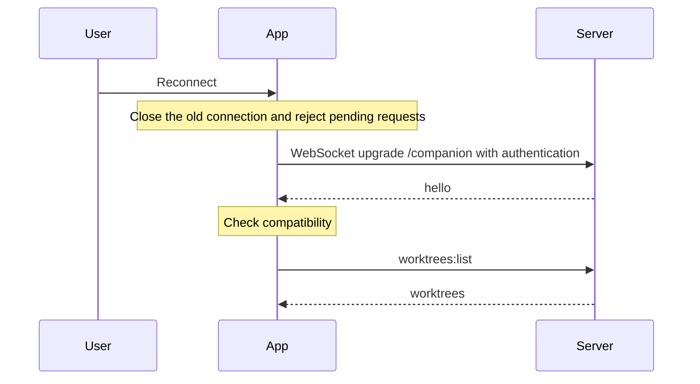
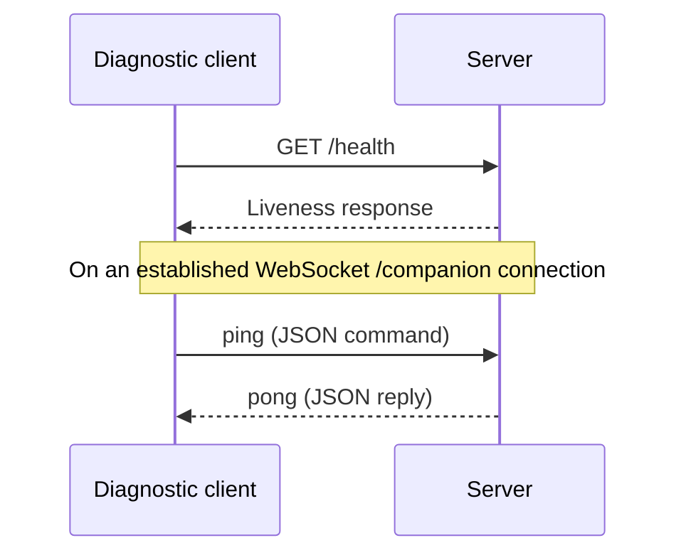
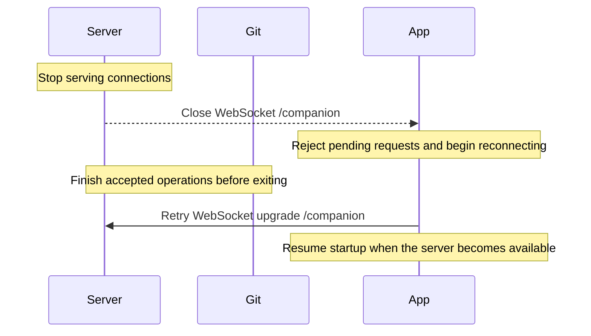

# Contributor Commands

- `python scripts/bootstrap.py | iex` (PowerShell) or `eval "$(python scripts/bootstrap.py)"` (POSIX): install and activate the expected Node.js version. Add `--force` to replace the vendored installation.
- `npm install`: install dependencies and the Electron binary.
- `npm run dev`: start Electron/Vite.
- `npm run server`: build and start the companion in a separate terminal. Append `-- --config path/to/server.yaml` to select a config.
- `npm run server:dev`: run the companion with file watching; accepts the same config argument.
- `npm run build` / `npm run build:server`: build everything / just the companion into `out/`.
- `npm run typecheck`: check app, companion, and tests.
- `npm test`: run socket and temporary Git repository integration tests. Git must be on PATH.
- `npm run lint` / `npm run lint:fix`: check / fix ESLint issues.
- `npm run format`: format with Prettier.
- `npm run upgrade`: upgrade dependencies to the latest peer-compatible versions, pin them, and install.

## Server Deployment

The companion runs independently of the desktop app. Deploy its build to a machine with Git and a compatible Node.js runtime, install production dependencies, and supply the server configuration. Worktree paths refer to that machine's filesystem.

# Architecture

- Keep direct dependencies pinned to exact versions. Use `npm run upgrade` to update existing dependencies.
- Keep contributor information here and end-user instructions in `README.md`. Keep both short and easy to understand.
- Documentation guidelines:
  - Encode high-level design decisions and workflows here. Keep implementation details in the code.
  - Think about what a tech lead who is not very familiar with the codebase would need to know to make informed architectural decisions.
  - Keep only duration information; exclude non-durable information such as version.
  - Avoid enumeration; replace with the broader idea being referenced.
  - Workflow documentation guidelines:
    - Think about the important actions a user can take and workflows initiated by the server.
    - Use a mermaid sequence diagram with details where necessary. Start from the trigger and follow the automation to its natural end.
    - Avoid conditional branches in diagrams. Describe possible responses and their reactions on a single edge or note.
    - Document the endpoints and commands being called on the server.
- Delegate aggressively to well-maintained libraries, even when the current requirement is small or isolated. They usually handle edge cases better and give us a stronger base for future requirements.
- This project is still in development. Assume the server and client always run the same build.

## Codebase Layout

The desktop app separates presentation from privileged work. The renderer owns the UI, the main process owns connections and OS access, and preload provides a narrow bridge between them. Credentials stay out of the renderer. App-owned UI components wrap the component library so it can be replaced without rewriting features.

The companion server owns configuration, Git operations, and the shared view of worktrees. Git is the source of truth; the server keeps a cache so listing is fast. Changes and refreshes run in order so concurrent clients see consistent results.

The shared layer defines the contract between the app and server. Library-backed schemas validate incoming data and provide the matching types. Keep both sides of the contract in step when behavior changes.

## Connections

The app maintains a WebSocket connection at `/companion` so the server can push changes to every connected app. The main process handles authentication and reconnection. The server rejects browser connections; remote deployments require authentication and encrypted transport. `GET /health` provides a public liveness check for operators.

Worktree commands return the current list in a `worktrees` reply. Changes and refreshes also broadcast `worktrees:updated` to all connected apps, including the requester. Failures return `error` without disconnecting the app. Message fields and validation rules live in the shared contract.

## Startup

The server loads and validates its configuration, then discovers worktrees for all configured projects. It accepts connections only after the cache is ready. On accepting a connection, the server sends `hello` without waiting for a command. The app checks compatibility before requesting the cached list with `worktrees:list`.

## Steady State

The app and server independently initiate background heartbeats on `/companion`. Each peer automatically answers WebSocket ping control frames with pong. The server closes unresponsive connections; the app retries lost connections and reloads the list after reconnecting.

## Worktree Updates

When an operation changes the cached Git state or a refresh completes, the server initiates a `worktrees:updated` broadcast on `/companion`. Every connected app receives the current list without polling, including the app that requested the operation. Apps use the newest update and ignore older responses. An app that missed updates while disconnected recovers through `worktrees:list` after reconnecting. External Git changes become visible when a user refreshes.

## Create Worktree

The user chooses a project, base branch, and path, then the app sends `worktrees:create`. A new branch name is optional; leaving it blank checks out the base branch directly. Git enforces its checkout rules. Creation can leave a worktree behind even when Git reports an error, so the server checks the actual Git state and shares any changes before returning the result. The app still shows the original error.

## Delete Worktree

The user confirms which worktree to remove, then the app sends `worktrees:delete`. The server protects main and locked worktrees, and Git refuses removal when local changes would be lost. The branch is retained.

## Refresh Worktrees

The user refreshes to pick up changes made outside the app. `worktrees:refresh` rescans Git, while `worktrees:list` reads the cache. After a successful scan, the server replaces its cache and shares the updated list with all connected apps.

## Reconnect

The user can force a fresh connection. The main process replaces the existing connection and returns to the startup workflow, including reloading the worktree list. If the server is unavailable, automatic retries continue.

## Check Server Health

An operator can call `GET /health` to check whether the server is listening. A client with an established `/companion` connection can send the JSON `ping` command and receive `pong` to check command responsiveness. Background heartbeats use WebSocket control frames instead.

## Server Shutdown

When the server is stopped, it closes client connections and lets accepted Git operations finish before exiting. Apps reject pending requests and return to automatic reconnection. Once the server is available again, the startup workflow reloads the list so apps can see the outcome of operations interrupted by the disconnect.

