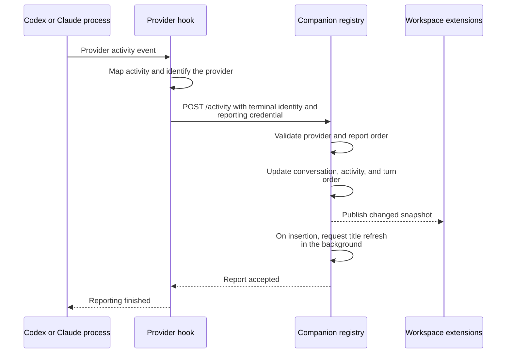
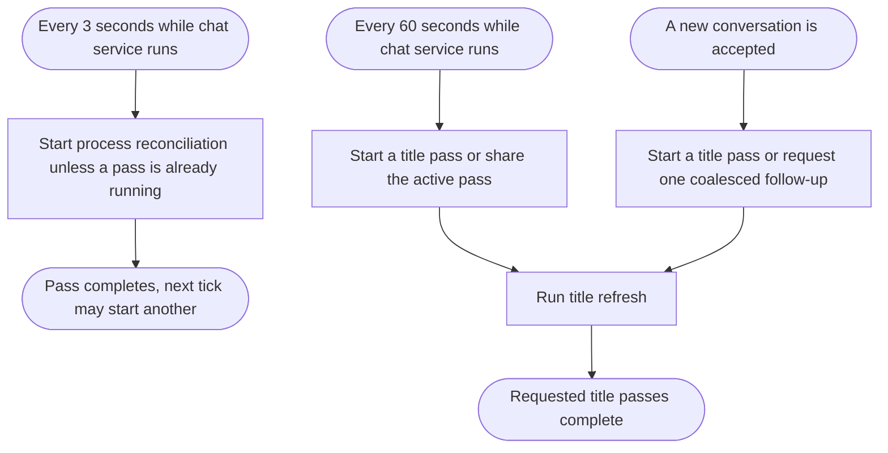
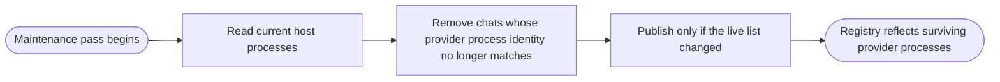
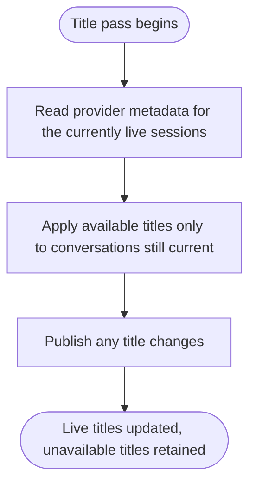
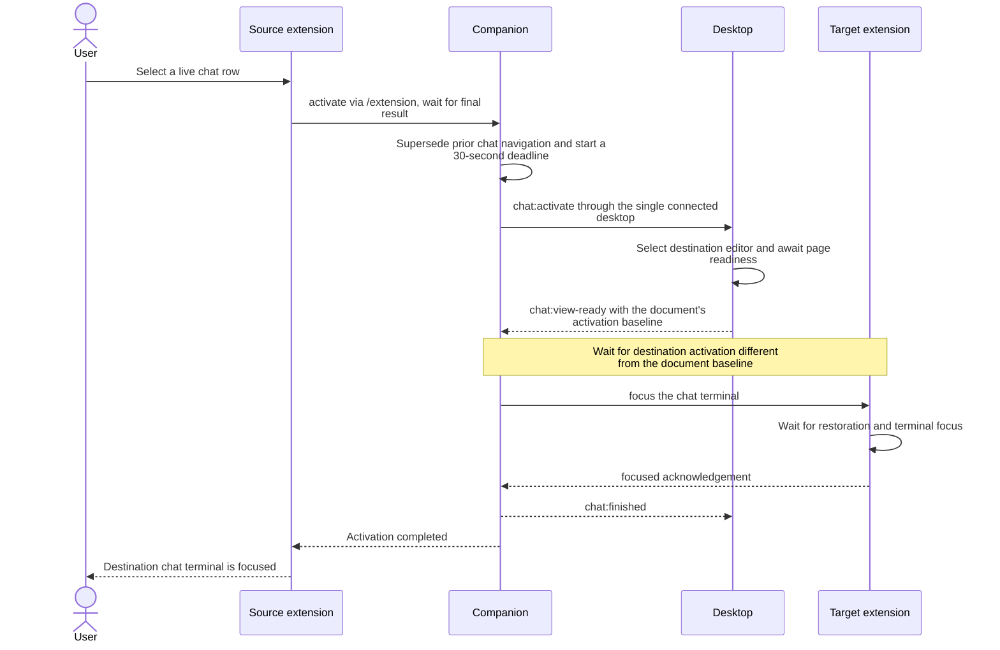

# Live chats

- The companion owns a shared in-memory registry of live conversations. Every connected workspace extension receives the same list, ordered by the latest user prompt or completed turn.
- There is one visible conversation per terminal. A later session in the same terminal replaces the previous entry; editor disconnection alone does not remove it.
- Sources: [chat service and navigation](../src/server/chats/chat-service.ts), [registry](../src/server/chats/chat-store.ts), [activity hook](../src/server/chats/chat-hook.ts), [provider behavior](../src/server/chats/chat-providers.ts).

## Report chat activity

- Codex launches without its shared daemon so hooks inherit the terminal’s reporting context and process ancestry. Customized launch commands must preserve this.
- The hook reports only terminals carrying ADE reporting context. The companion verifies provider process identity, including start time, and ignores obsolete reports.
- Claude subagent events and unrelated notifications do not change the main conversation. Tool failures resume working unless the hook reports an interruption; failed turns return to idle.
- Work in progress displays as working. Permission requests, explicit user-input waits, completed turns, and reported interruptions display as idle. Claude manual compaction returns to idle on completion; automatic compaction continues the working state. Normal Claude Esc cancellation has no completion hook, so activity remains unchanged until another supported hook arrives.
- User prompts and completed assistant messages supply the latest message preview and ordering time. [Titles](#refresh-chat-titles) refresh from provider metadata in the background.
- Accepted working-to-idle transitions also emit a live event to connected desktops for [native notifications](desktop.md#notify-when-a-chat-becomes-idle).
- New conversations request [title maintenance](#schedule-chat-maintenance) without waiting for metadata reads.
- Hooks are bounded and best effort: an unavailable companion does not delay or alter provider decisions beyond the short reporting deadline.

## Schedule chat maintenance

- Each process pass runs [reconcile live processes](#reconcile-live-processes); each metadata pass runs [refresh chat titles](#refresh-chat-titles).
- The schedules begin when the local chat listener opens and stop at companion shutdown.
- Activity changes, process removal, and title application share ordered registry updates. Metadata reads run in the background so they do not block activity reporting.

## Reconcile live processes

- Process identity, not an idle timeout or editor connection, determines chat lifetime.

## Refresh chat titles

- Codex titles come from its local state; Claude titles come from the official Agent SDK’s session metadata lookup, including durable renamed titles. Each Claude provider home is read in an isolated worker so SDK configuration cannot affect another home or the companion. Neither provider’s files are modified. Missing or temporarily unavailable metadata leaves existing titles intact.
- The sidebar shows placeholders until a title or message is available.

## Navigate to a chat

- Desktop notification clicks request the same activation directly through the companion connection; the desktop receives the final result after terminal focus.
- The companion requires exactly one connected desktop for chat navigation. Desktop selection uses the shared [worktree opening](desktop.md#open-a-worktree) and [supersession](desktop.md#supersede-navigation) workflows, then the target performs [terminal focus](extension.md#focus-a-chat-terminal).
- Page readiness is not terminal readiness. The page's activation baseline prevents a newly loaded document from sending focus to the old extension host.
- Timeout, supersession, page failure, or a participating connection closing finishes the source request with an error and cancels outstanding terminal focus. Shared editor startup and retained page loading can continue.
- Startup failures remain companion-owned worktree errors. Desktop page failures are also stored on the worktree without delaying the chat failure reply.
