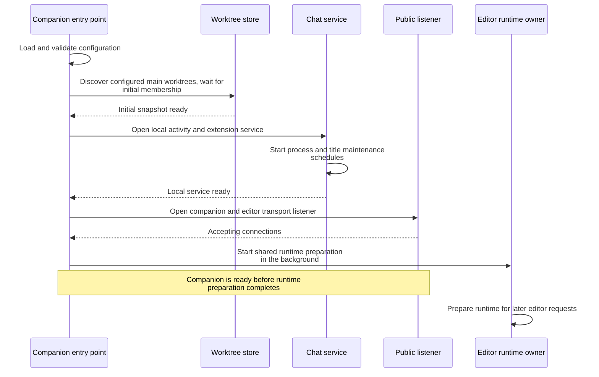
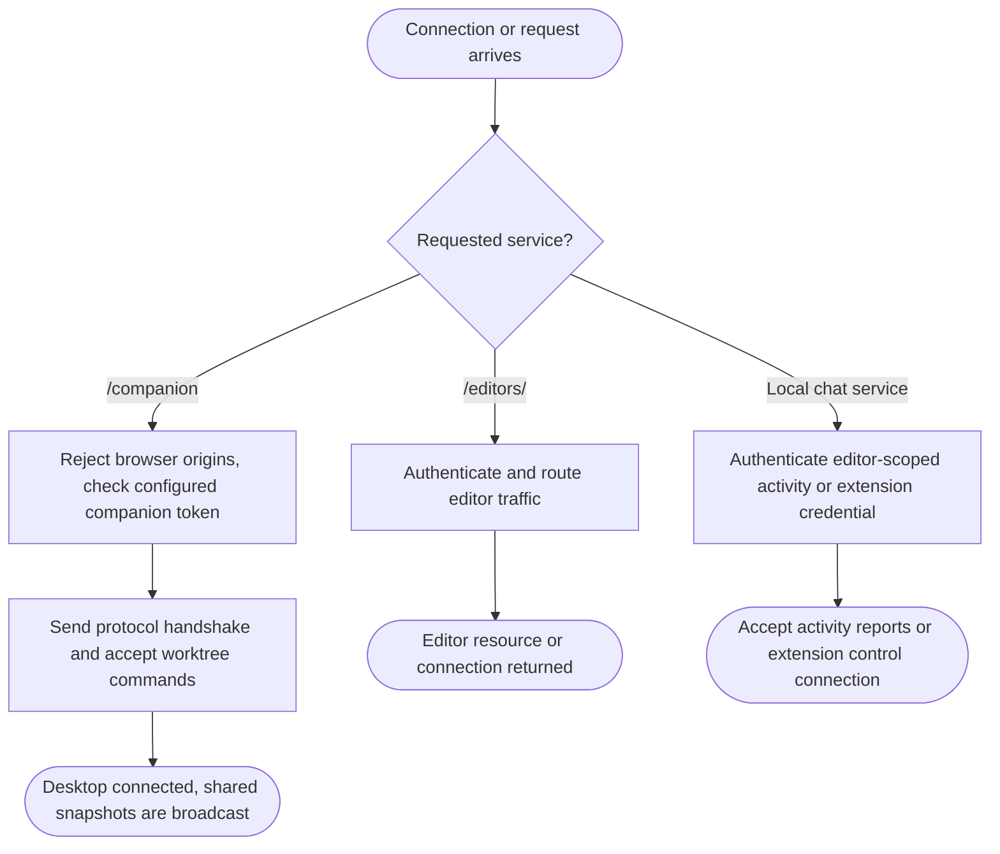
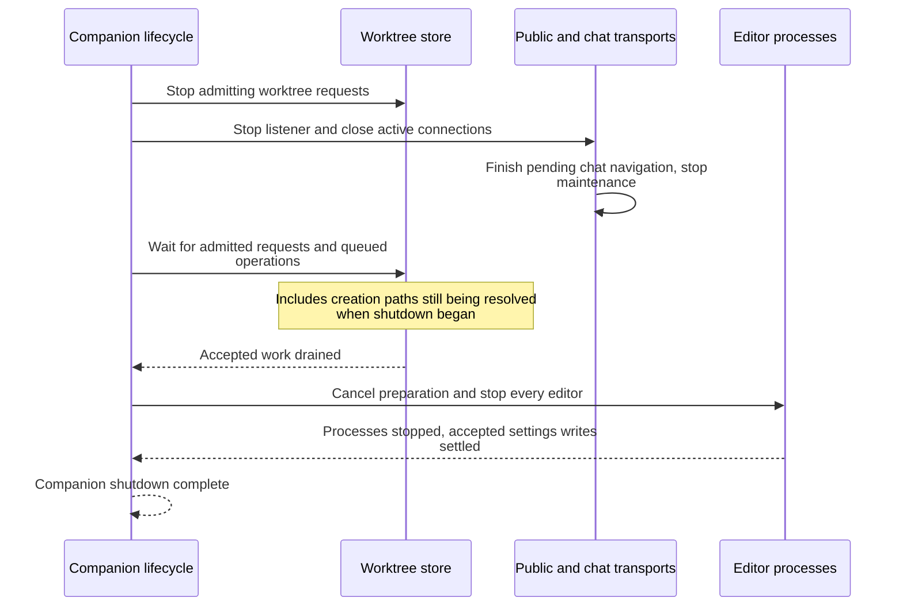

# Companion

- The companion account owns configured repositories, Git commands, local VS Code resources, and editor processes. The companion keeps running when desktop clients disconnect.
- Sources: [service composition](../src/server/server.ts), [entry point](../src/server/index.ts), [companion transport](../src/server/companion-transport.ts), [configuration](../src/server/config.ts).

## Start the companion

- Startup discovery applies [Git membership](worktrees.md#refresh-and-apply-membership) before the public listener opens. Configuration must identify main worktree roots; an absent default configuration produces an empty project list.
- [Runtime preparation](editors.md#prepare-the-shared-runtime) is shared with later editor requests. [Chat maintenance](chats.md#schedule-chat-maintenance) continues for the service lifetime.
- Configuration is loaded at startup. Changing it requires restarting the companion.

## Admit connections

- Editor pages can only reserve and submit terminal pastes through their narrow desktop bridge; main proxies target queries to the companion. Main holds the companion credential; editor traffic uses a separate credential per running editor.
- Chat reporting and extension control use distinct credentials on the loopback service. Terminal processes receive reporting access, while the extension host receives navigation control.
- Command admission stops during shutdown. Each transport owns its connections, subscriptions, and timers.

## Stop the companion

- Startup failure uses the same cleanup path.
- Closing transports happens before waiting for accepted work; disconnected clients do not cancel queued mutations.
- [Editor stopping](editors.md#editor-process-lifetime) preserves workspace data directories for later starts.
