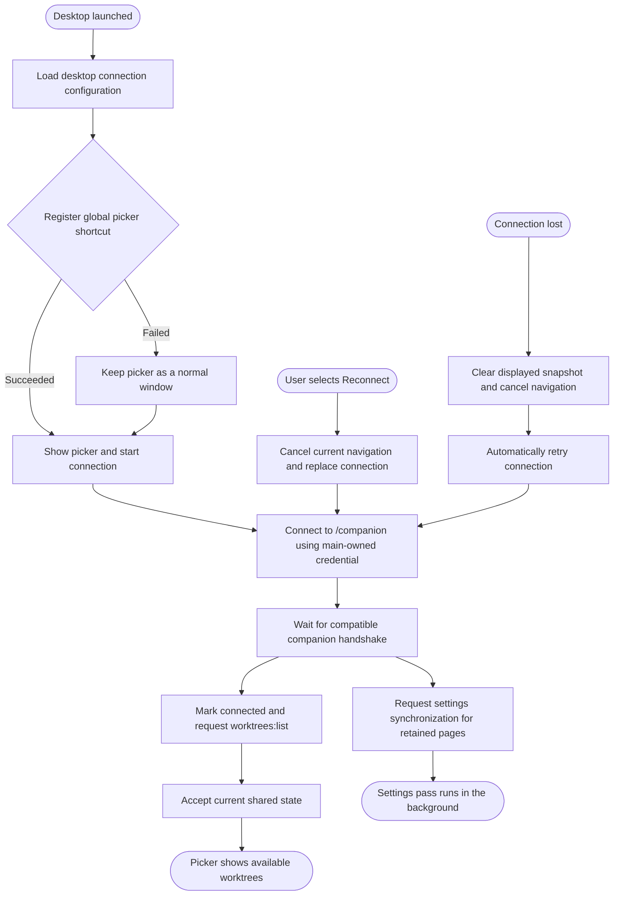
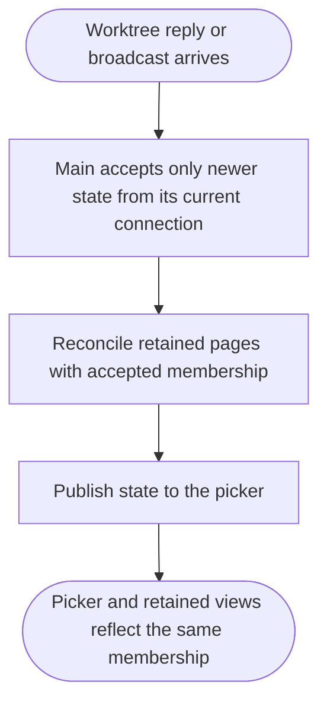
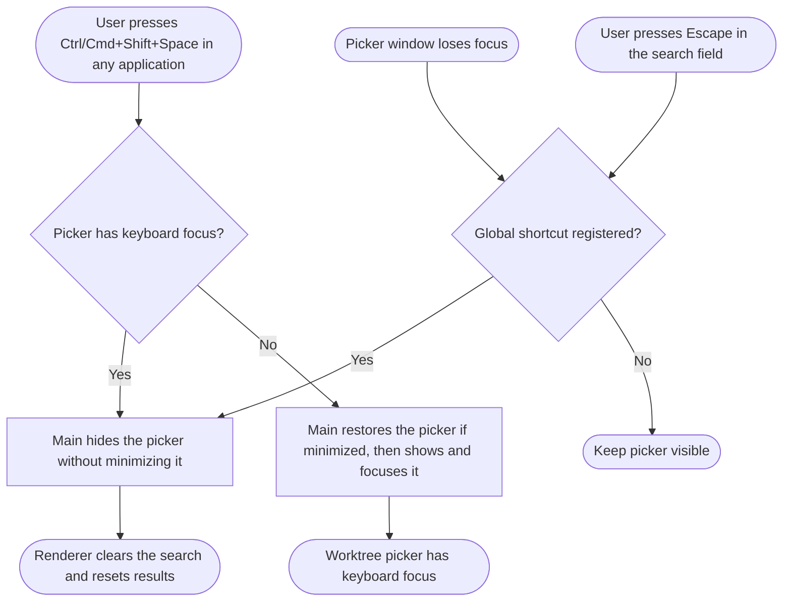
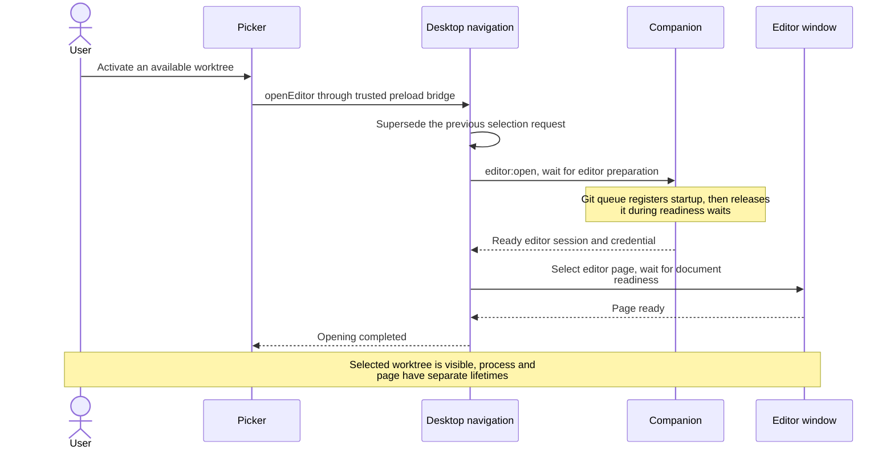
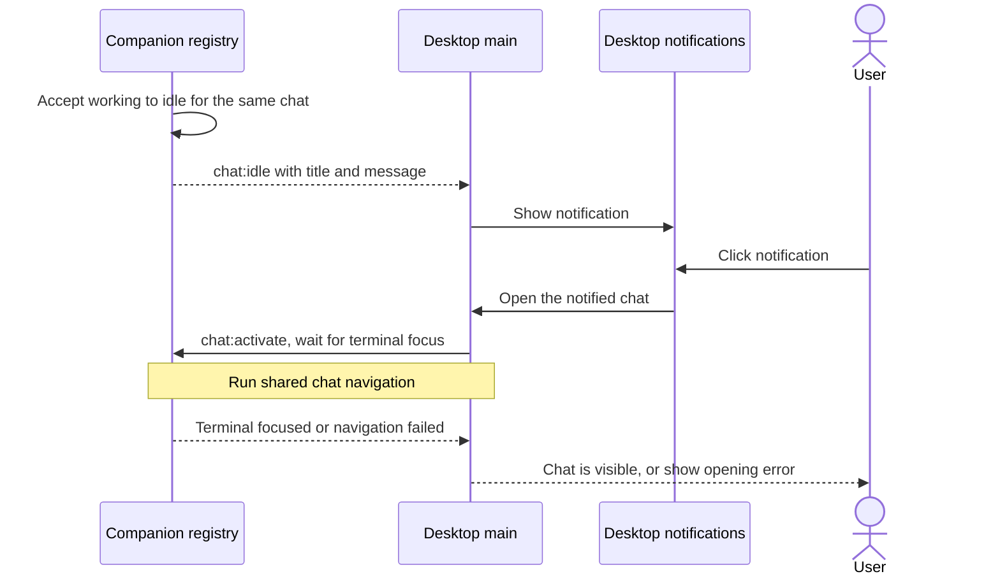
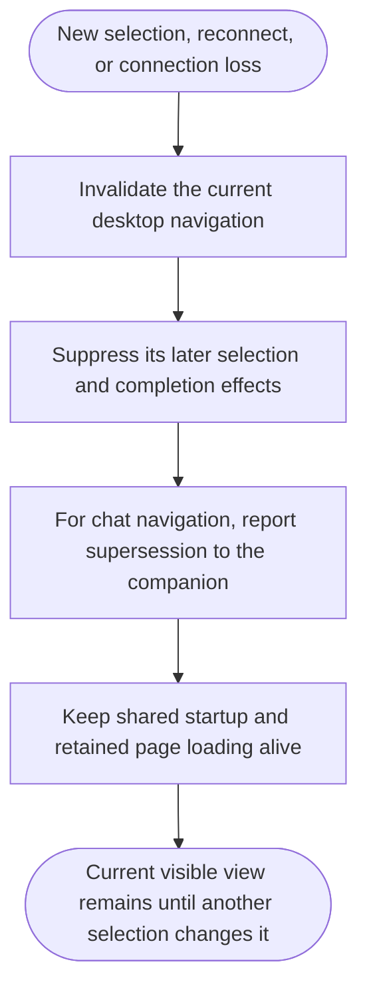
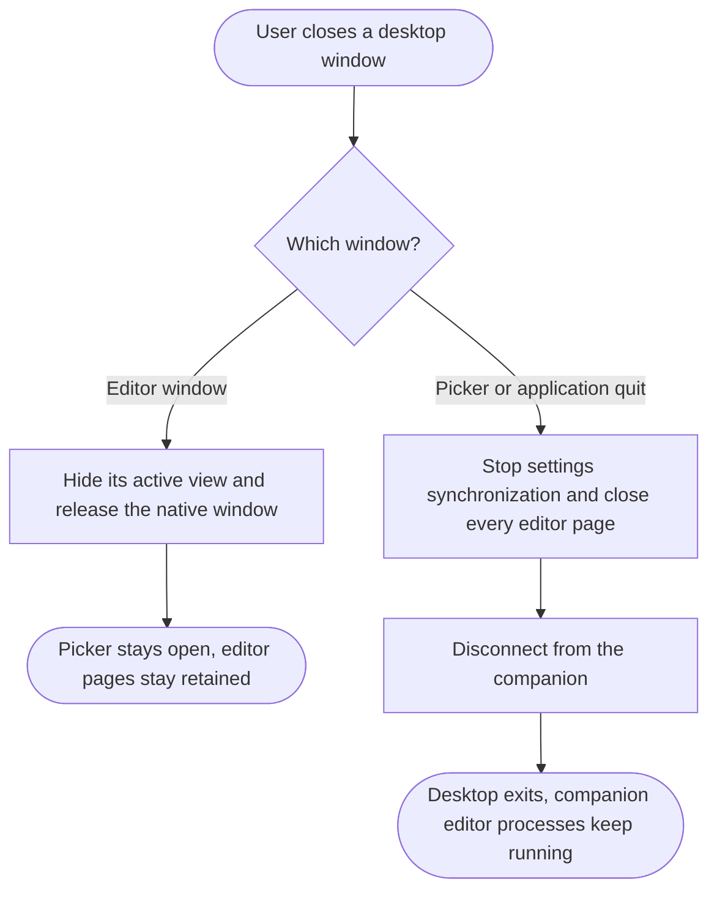

# Desktop

- Main owns the companion connection, accepted snapshot, credentials, and navigation. The picker renderer owns search, dialogs, and temporary interaction state.
- Sources: [main entry point](../src/main/index.ts), [connection](../src/main/companion-client.ts), [state](../src/main/companion-state.ts), [navigation](../src/main/editor-navigation.ts), [picker](../src/renderer/src/App.tsx).

## Connect to the companion

- File configuration supplies the companion URL and optional token; environment configuration overrides it. Invalid configuration prevents desktop startup.
- A connection must complete protocol discovery before other companion events are accepted. The companion [authenticates the connection](companion.md#admit-connections).
- Reconnect resets snapshot ordering. Retained editor pages stay alive while the companion connection is unavailable.

## Accept shared state

- Connection and refresh requests read through main; command completion does not return snapshots to the renderer.
- Reconciliation removes pages for absent worktrees. A stopped editor status alone does not dispose its page.
- Shared row state survives desktop reconnection because the companion owns it. [Worktree membership](worktrees.md#refresh-and-apply-membership) remains separate from operation and editor status.

## Toggle the worktree picker

- Main registers the global shortcut before showing the picker or connecting to the companion and releases it on quit. If registration fails, startup continues with a normal window that stays visible on blur and Escape and can be minimized and restored through the desktop.
- Dismissal clears search and resets selection and scrolling, including when the search is already empty.
- Explicit dismissal returns focus to the window used before opening the picker. Hiding after focus moves elsewhere preserves that destination. Windows and Linux/X11 capture a native window identity before showing the picker; macOS uses a nonactivating panel, and Wayland delegates the handoff to its compositor. Closed targets and denied activation requests fall back to the operating system's normal hide behavior.

## Open a worktree

- The server performs [editor preparation](editors.md#prepare-an-editor); the window performs [page selection](editor-pages.md#select-an-editor-page). Opening completes after both.
- Search filters basename and branch. Pointer or keyboard activation skips disconnected, prunable, missing, and mutating worktrees. Progress updates preserve a still-valid selection; changed search results reset it.
- Create and delete dialogs suspend picker interaction and invoke [worktree mutations](worktrees.md#schedule-a-mutation). Dismissing a dialog does not cancel an accepted server operation.
- An opening failure becomes a companion row error; if main cannot store it there, the picker retains a local error. Opening an editor does not clear an existing error.

## Notify when a chat becomes idle

- Notifications use the chat title and latest message, falling back to the worktree path when no message is available. They also appear while the desktop is focused, subject to operating-system notification settings.
- Only accepted working-to-idle transitions notify. Initial idle reports, repeated idle reports, title updates, session replacement, and process removal do not. Transitions while disconnected are not replayed.
- Each chat retains at most one notification. A later notification replaces it; clicking, disconnecting, or quitting clears it.
- Clicks use [chat navigation](chats.md#navigate-to-a-chat), including terminal acknowledgement and stale-chat errors. Notification navigation requires exactly one connected desktop, as sidebar navigation does.

## Supersede navigation

- Picker and [chat navigation](chats.md#navigate-to-a-chat) share this coordinator. Chat requests remain current until the companion reports terminal completion.
- A page that finishes loading after another page is selected never reselects itself.

## Close a window

- Desktop shutdown does not wait for editor unload approval, saves, backups, or settings synchronization. Recent unsaved browser state can be lost.
- [Companion shutdown](companion.md#stop-the-companion) is a separate lifecycle.
