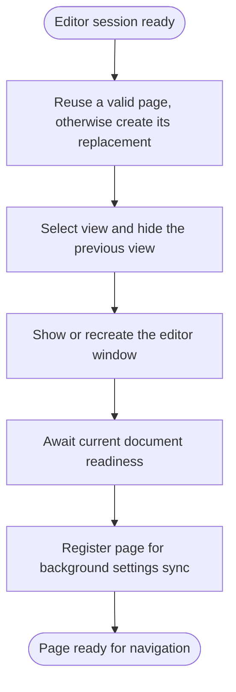
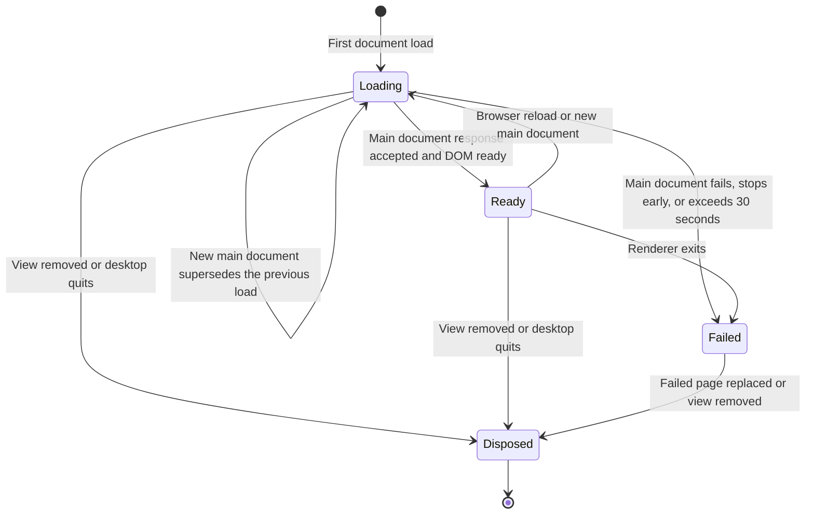
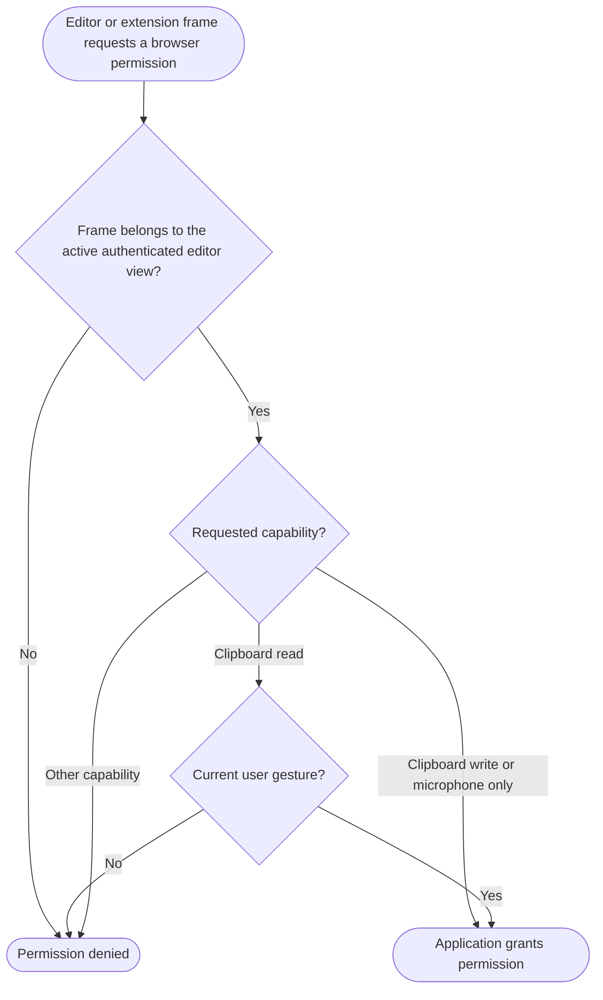

# Editor pages

- Desktop main owns one editor window and retained pages keyed by editor identity. Selection belongs to the window; document readiness belongs to each page.
- Pages share persistent browser storage per companion origin. They have no Node access or preload bridge and remain alive when hidden.
- Sources: [editor window](../src/main/editor-window.ts), [page readiness](../src/main/editor-page.ts).

## Select an editor page

- A closed editor window is recreated around retained pages on the next open. Selecting another worktree does not unload the previous one.
- Missing pages are created; failed pages and pages with an old process credential are replaced.
- Selection happens before the readiness wait. A different navigation can select another page during that wait; completing the old load does not change selection.
- A page failure during opening rejects the wait and disposes that failed page. A later open can create a replacement.

## Follow document readiness

- Opening waits through superseded document loads until the current document is ready. Readiness has a 30-second deadline and does not wait for subresources or extension terminal restoration.
- Removing a worktree from an accepted desktop snapshot disposes its page. A new process credential also replaces the old page at its next open.
- [Window closure](desktop.md#close-a-window) and process lifetime are different: closing only the editor window hides pages; quitting the desktop disposes them.

## Request browser permissions

- The owning editor view must be active; its extension frames remain subject to VS Code and Chromium frame policies. Operating-system microphone permission still applies.
- Top-level navigation stays inside the editor's companion origin and path. New browser windows are denied.
