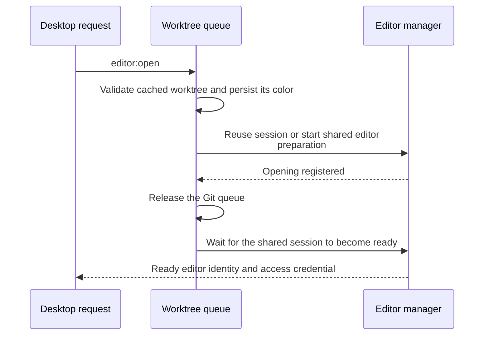
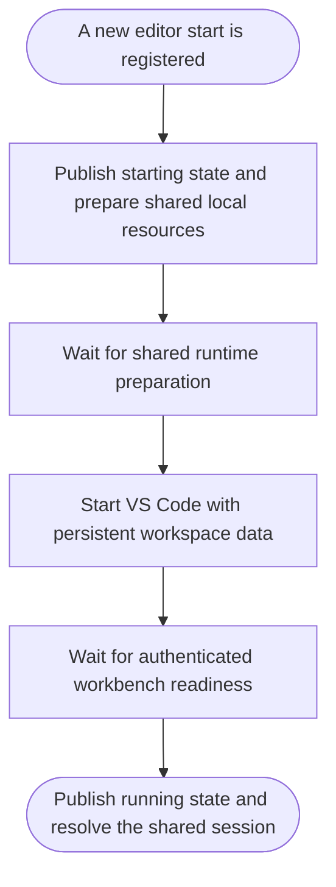
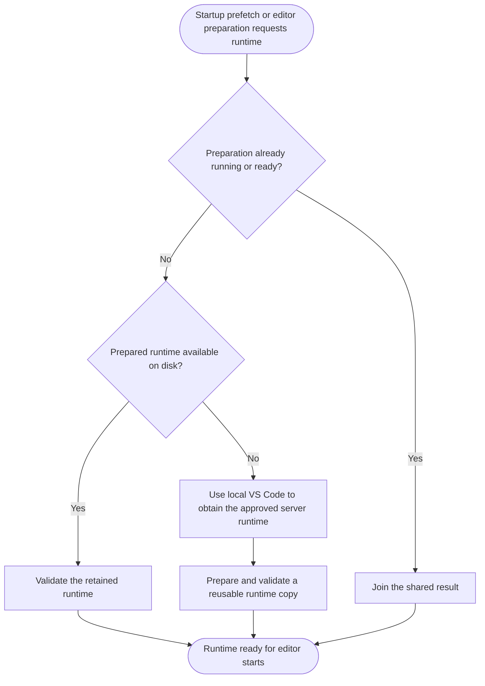
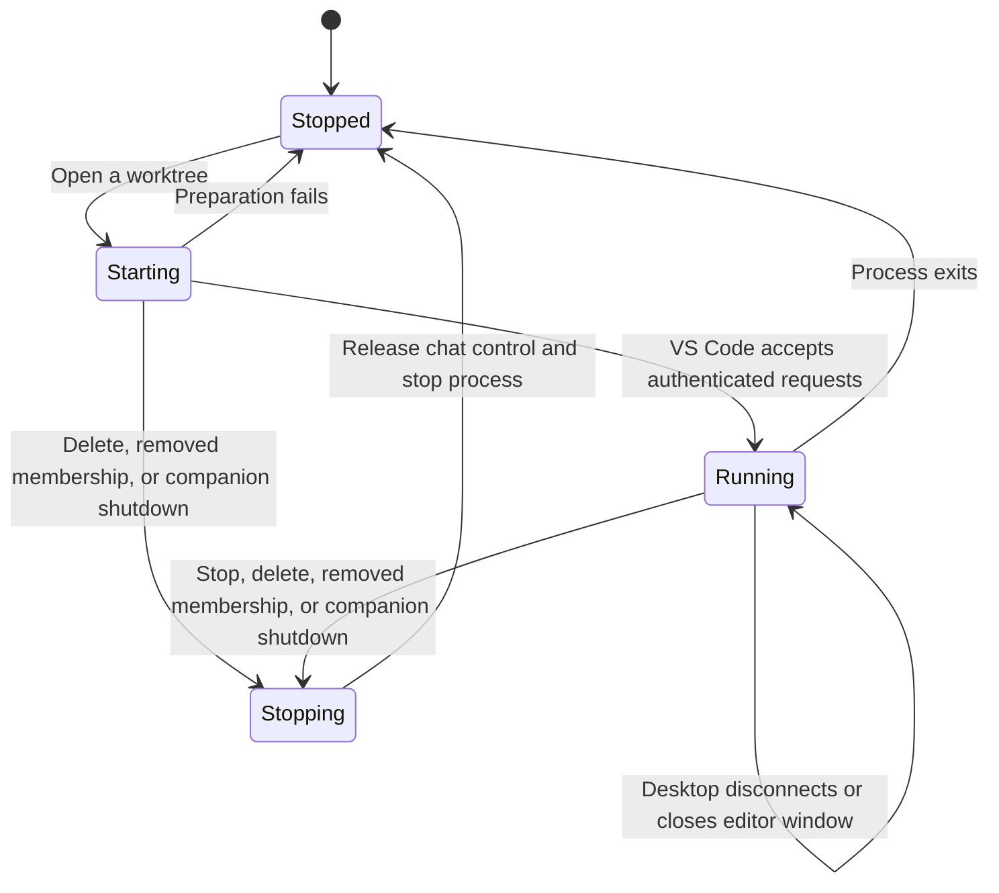
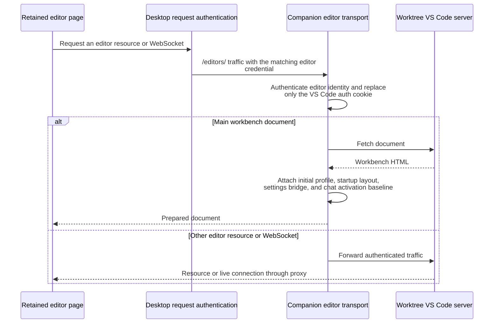

# Editor processes

- The companion owns one process per opened worktree, shared by all clients. Stable worktree identities retain workspace data across process restarts; each process start receives a fresh access credential.
- All editors share the companion account's local VS Code extensions directory and settings service. Workspace server data remains separate for each worktree.
- Sources: [editor manager](../src/server/editors/editor-manager.ts), [runtime owner](../src/server/editors/vscode-runtime.ts), [editor transport](../src/server/editors/editor-transport.ts), [profile preparation](../src/server/editors/local-vscode.ts).

## Prepare an editor

- Runtime downloads and readiness waits do not hold the Git queue. Multiple opens share a pending start instead of launching duplicate processes.
- A new session starts [editor process preparation](#start-an-editor-process) in the background, leaving the Git queue free. Existing sessions reuse the same readiness result.
- Process readiness completes the server request. The desktop must still [load the editor page](editor-pages.md#select-an-editor-page).

## Start an editor process

- Environment preparation reads local profile resources and creates the shared settings service. Later [document delivery](settings.md#initialize-the-browser-profile) lets VS Code initialize a browser profile.
- VS Code runs on loopback behind the companion proxy. It automatically trusts the configured workspace, enables persistent terminal sessions, and avoids automatic Python environment commands in provider terminals.

## Prepare the shared runtime

- [Companion startup](companion.md#start-the-companion) starts this work in the background; [editor preparation](#prepare-an-editor) waits for its result when needed.
- Progress is shared with waiting editor rows. Failed preparation can be retried by a later open; stopping one worktree does not cancel preparation shared by other worktrees.

## Editor process lifetime

- Process exit releases its editor registration and publishes stopped status. [Chat reconciliation](chats.md#reconcile-live-processes) separately decides when chat records disappear.
- Deletion and accepted membership removal cancel pending starts and stop running editors. Companion shutdown cancels shared preparation and stops all editors.
- The picker row menu offers **Stop VS Code server** for any worktree with a running editor, including the main worktree. It is unavailable while the editor starts or the picker is opening it, so an explicit stop never surfaces as an opening failure. `editor:stop` runs in the worktree queue, keeps membership, and is refused during startup or while a creation or deletion owns the row. Retained desktop pages stay until the worktree is reopened, which starts a fresh process with a new access credential.
- Workspace data remains on disk. VS Code's reconnection grace governs disconnected extension hosts and terminals; it does not determine the companion-owned process lifetime.

## Serve editor traffic

- Main supplies credentials only for the matching companion origin and editor path. The proxy removes the app authorization header before forwarding to VS Code and preserves other browser cookies, including display language.
- The [initial profile](settings.md#initialize-the-browser-profile) seeds a new browser profile. The activation baseline makes [chat navigation](chats.md#navigate-to-a-chat) wait for an extension belonging to the new document.
- Each fresh document opens the ADE sidebar through VS Code's startup layout. The secondary sidebar containing Chat starts hidden by default; explicit settings and saved visibility take precedence, so later user changes are remembered.
- Authenticated settings requests are handled by the companion's [settings service](settings.md#synchronize-one-snapshot) rather than forwarded to VS Code.
