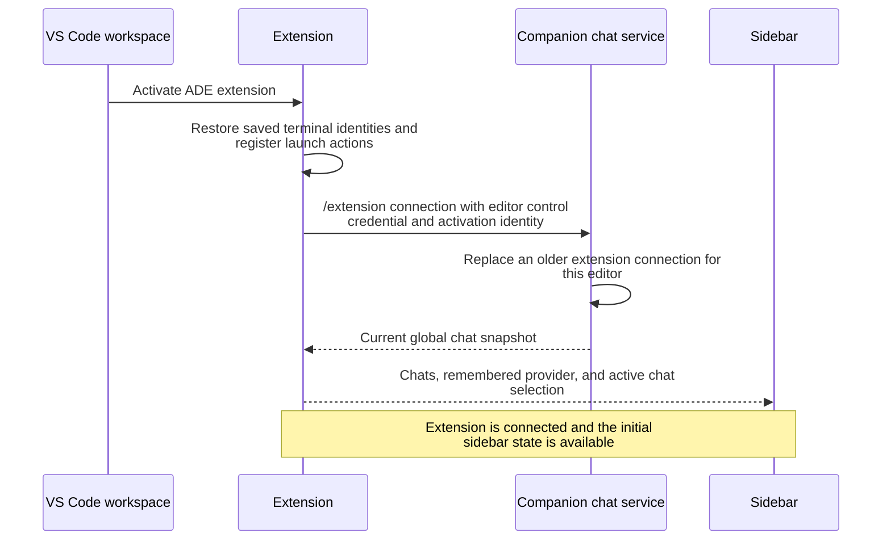
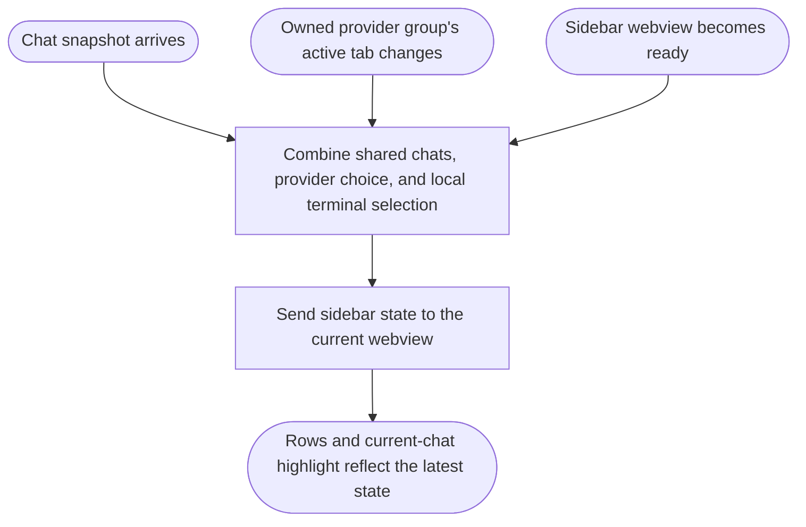
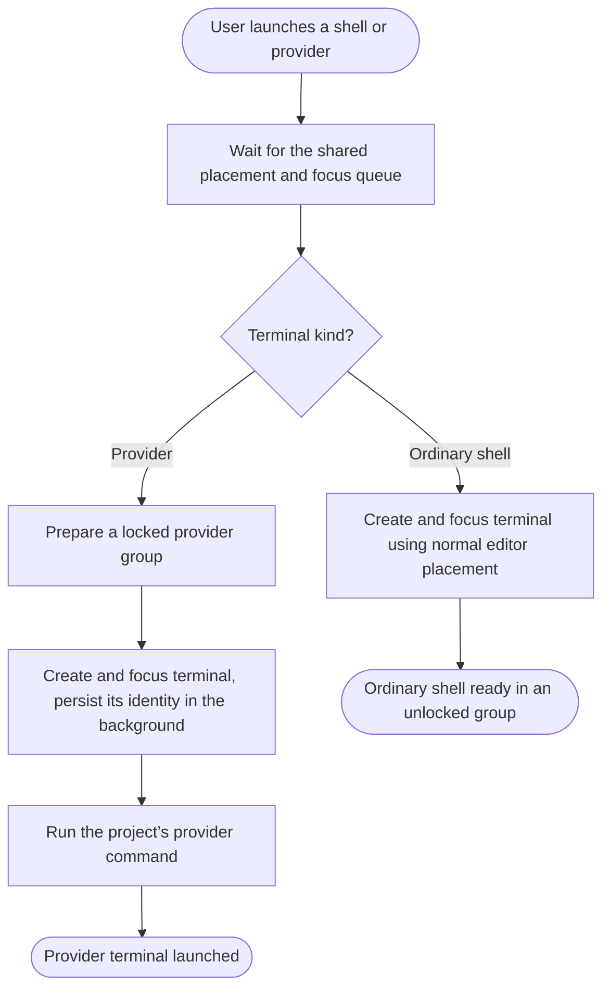
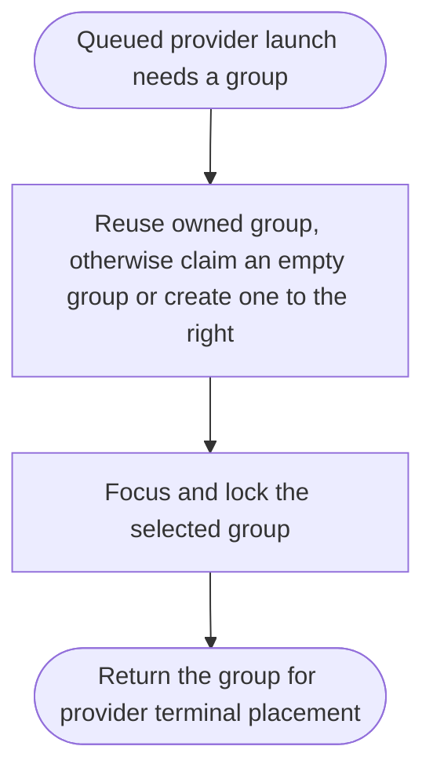
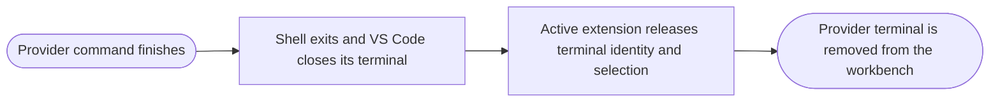
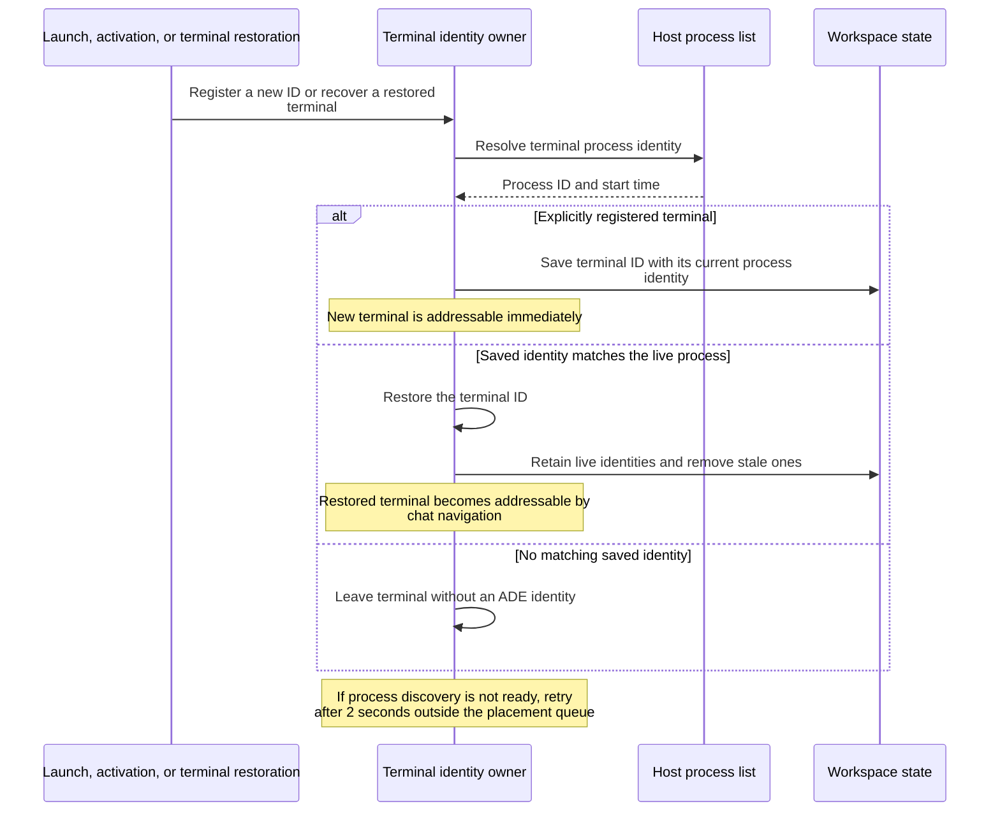
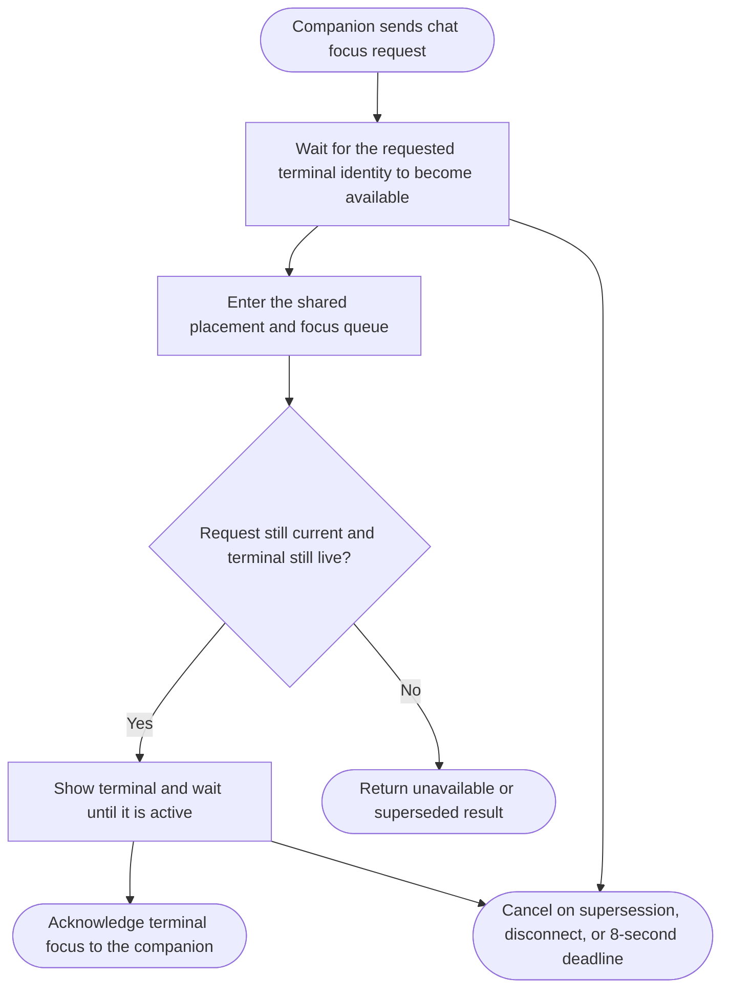

# Workspace extension

- The extension runs with the workspace on the companion machine. It owns terminal placement, terminal identities, the ADE sidebar, and destination terminal focus.
- Codex and Claude commands launch provider terminals and report [live chat activity](chats.md#report-chat-activity).
- Sources: [activation](../extensions/ade-terminals/src/extension.ts), [launcher](../extensions/ade-terminals/src/launcher.ts), [terminal identities](../extensions/ade-terminals/src/terminal-identities.ts), [chat controller](../extensions/ade-terminals/src/chats.ts), [sidebar](../extensions/ade-terminals/src/sidebar.ts).

## Activate and connect

- The control credential enters only the extension host and is removed from its inherited environment before extension-spawned processes can receive it. Provider terminals receive activity-reporting access instead.
- A new extension activation replaces older control connections; a reconnect from an obsolete activation cannot reclaim ownership.
- The extension automatically reconnects after connection loss while it remains active.
- Sidebar actions [launch terminals](#launch-a-terminal) or request [chat opening](chats.md#open-a-chat). Choosing a provider both remembers the choice and launches it.
- Extension deactivation stops its observers and connection without killing workspace terminals. Terminal restoration and placement ownership have separate lifetimes.

## Update the sidebar

- Selection follows the active terminal tab in the group owned by this launcher, even when another editor group has focus. Terminal identity restoration can make that selection match a live conversation later.
- Chat snapshots and local selection changes update the sidebar without waiting for launch or navigation completion.

## Launch a terminal

- Launches and resolved chat focus share one queue because group changes affect the whole workbench. Process discovery and identity recovery run outside that queue.
- A terminal uses the single workspace folder as its working directory. Provider terminals receive a new terminal ID and immediately start [identity persistence](#restore-terminal-identities).
- The companion supplies the project’s `chatCommands` from `server.yaml` to every worktree editor. Omitted commands use `codex --no-daemon` and `claude`; extension settings do not configure launches.
- The shell runs the configured command on the workspace machine. If placement fails after terminal creation, the new terminal is disposed.

## Prepare a provider group

- Provider group ownership lasts only for the current extension activation and is released if the group disappears or becomes empty. Saved terminal identities do not grant ownership of restored editor groups.
- Locking keeps ordinary file opens from displacing the provider group. Ordinary shells use VS Code's normal routing around locked groups.

## Finish a provider terminal

- The [provider shell command](../extensions/ade-terminals/src/provider-command.ts) owns exit cleanup even if the desktop or extension disconnects. Ordinary shells remain until they exit or the user closes them.
- Closing a terminal does not directly remove a live chat. The companion runs [process reconciliation](chats.md#schedule-chat-maintenance) in the background to detect provider exits and remove their conversations.

## Restore terminal identities

- Process start time distinguishes a surviving shell from a reused process ID. Recovery never overwrites a newer explicit registration.
- Closing a terminal cancels its recovery and removes its saved identity. Deactivation stops recovery while preserving saved workspace state for the next activation.

## Focus a chat terminal

- Waiting for restoration does not hold the workbench queue. The focus acknowledgement completes the companion's [chat open](chats.md#open-a-chat).
- A newer request or cancellation prevents an older request from subsequently taking focus.
