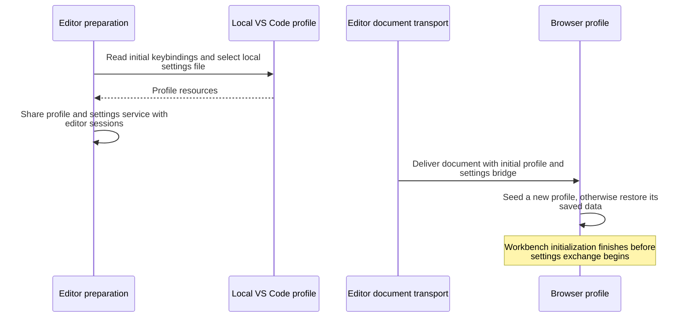
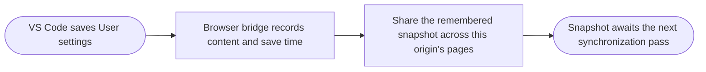
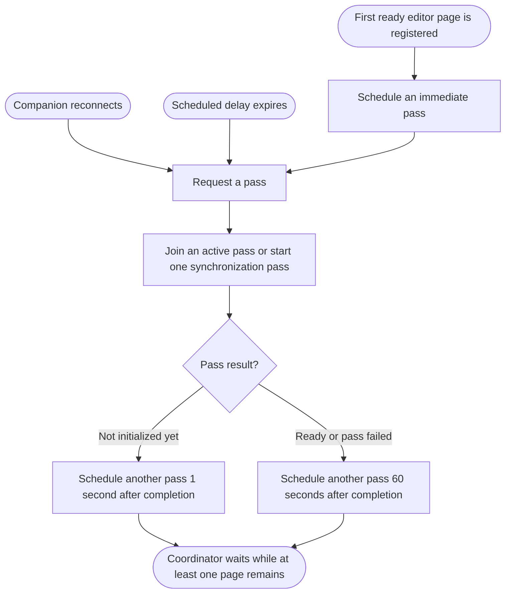
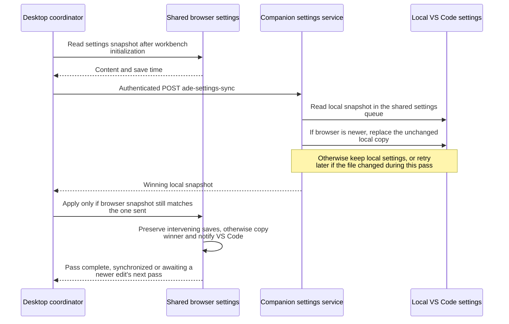

# Settings

- Settings synchronization exchanges the complete VS Code User settings file between persistent browser storage and the companion account's local VS Code profile. It does not merge individual settings.
- Newer save time wins, compared to the millisecond; equal times favor the companion copy. Copies preserve save time, so synchronization itself does not create a newer edit.
- One desktop coordinator serves all retained pages at a companion origin. One companion settings queue serves all worktrees and clients for the local file.
- Sources: [profile initialization](../src/server/editors/local-vscode.ts), [desktop coordinator](../src/main/settings-sync.ts), [browser storage bridge](../src/editor-browser/settings-sync.ts), [companion settings service](../src/server/editors/settings-sync.ts).

## Initialize the browser profile

- [Editor preparation](editors.md#prepare-an-editor) selects the local resources; [document serving](editors.md#serve-editor-traffic) attaches them to each page. VS Code applies profile initialization only for a new browser profile.
- New profiles receive local keybindings and an empty User settings file before their first settings exchange.
- Keybindings are seeded once. User settings use ongoing synchronization. Companion-owned Remote settings and workspace settings remain separate.

## Observe a browser save

- Workbench initialization and synchronization copies are not user saves. Native saves receive a new save time even if their contents are unchanged.
- Before the first observed user save, browser settings have an initial time of zero, allowing the companion's existing file to win initial synchronization.

## Schedule synchronization

- Concurrent triggers share one run. A run uses one available page for shared browser storage and can try another if that page is unavailable.
- Removing the final page cancels the active run and timer. Desktop shutdown stops synchronization without waiting for it.
- A browser save records its timestamp but does not itself trigger network traffic; the main-process coordinator owns the schedule.

## Synchronize one snapshot

- Both sides protect edits made during an exchange. The browser checks content and remembered save time, including a save that changes content and then changes it back.
- File copies are atomic and keep the winning timestamp. The browser bridge handles storage and notifications; main owns network requests and credentials.
