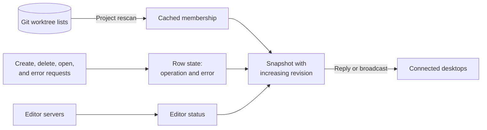
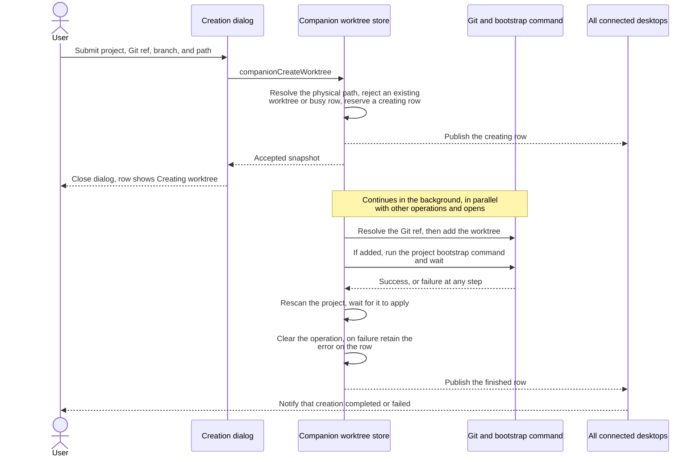
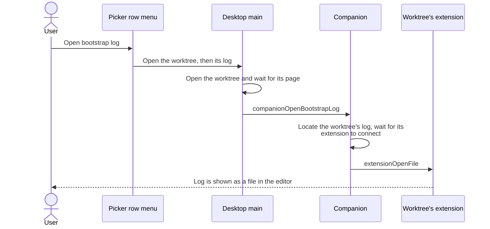
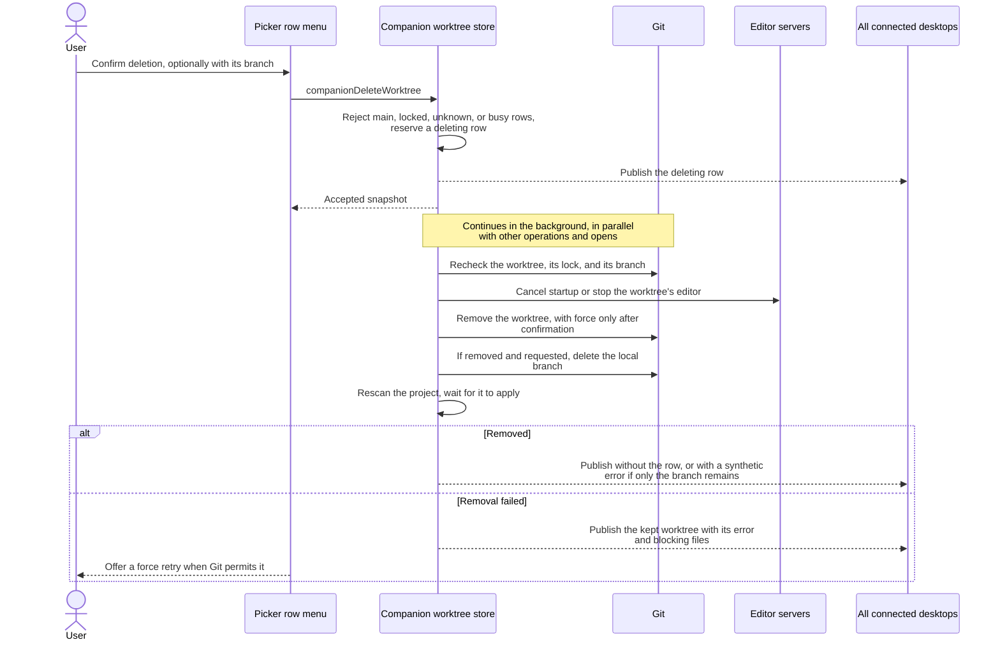
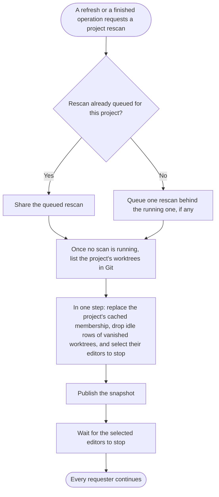
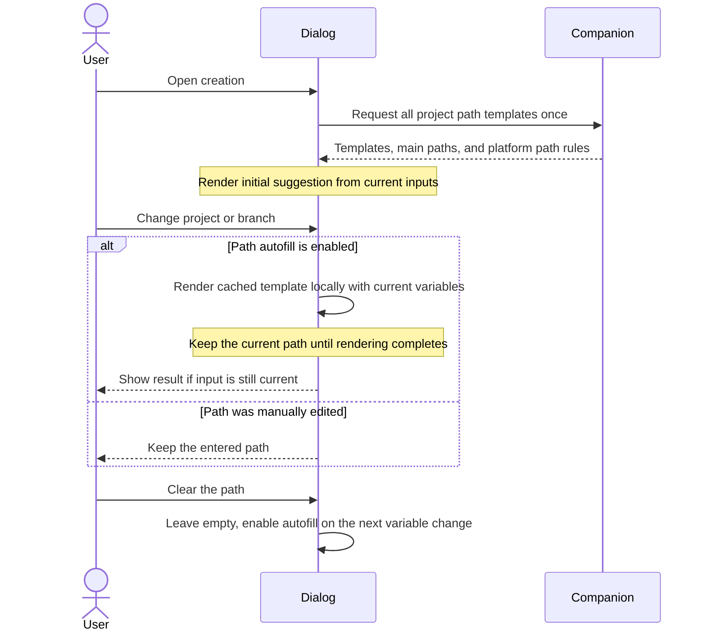
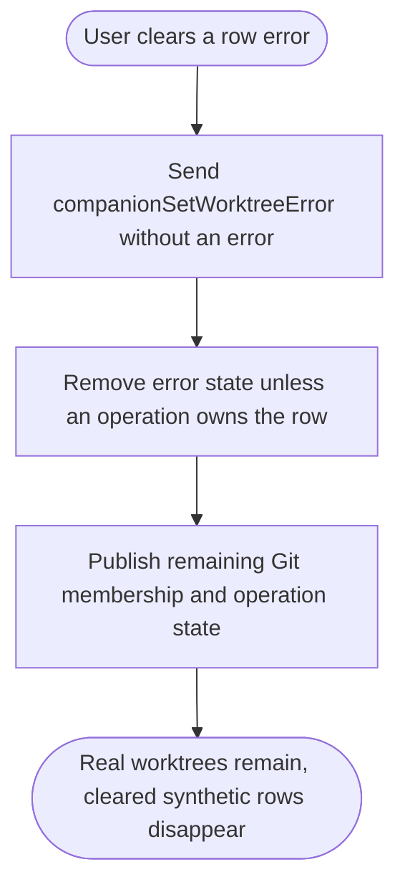

# Worktrees

- Git is the only source of worktree membership. The companion caches it and replaces the cache only by [rescanning a project](#rescan-a-project); listing reads the cache without running Git.
- Each row also has state the companion owns: an operation (creating or deleting) and a retained error. Synthetic rows show a pending or failed creation where Git has no worktree.
- There is no shared queue. Creations, deletions, and editor opens run in parallel. A row's operation blocks only other actions on that same worktree: opening, stopping its editor, deleting, or creating at its path.
- A row keeps its operation until a rescan that started after its Git work has been applied, so a row is never released before membership reflects the result.
- External Git changes appear after a refresh or after the next operation in that project finishes.
- The picker lists running or starting editors first, most recently opened first. Desktop main records the time of every open, whatever started it: the picker, a chat, or a notification. Open worktrees never opened from this desktop, and unopened worktrees, retain companion order within their groups. Search preserves this ordering; changes to the displayed order reset selection and scroll to the first available result.
- Presentation prioritizes an operation or opening progress, then a retained error, then editor status.
- Worktree names use their assigned color while the editor is starting or running and grey when it is stopped. The companion saves a color per worktree identity in its data directory before editor startup; it survives editor stops, reconnects, and companion restarts. The picker and extension chat list use the same color. Reopening restores the saved color. New assignments favor the least-used palette color, counting saved assignments for stopped worktrees too.
- Sources: [worktree store](../src/server/worktrees/worktree-store.ts), [mutation dialogs](../src/renderer/src/components/worktree-actions.tsx).

## What a snapshot contains

- Any change to one of the three inputs publishes a new snapshot to every desktop. Editor status changes publish without rescanning Git.
- Desktop main [accepts newer snapshots](desktop.md#accept-shared-state) and reconciles retained pages before updating the picker.

## Create a worktree

- Acceptance is separate from completion. Admission failures leave the dialog open; later failures belong to the shared row and survive the initiating desktop disconnecting. Creation never opens an editor automatically.
- The [rescan](#rescan-a-project) decides the outcome's membership. A failing Git hook or bootstrap can leave a real worktree, whose row stays usable alongside its error; a failure with no worktree remains as a synthetic error row.
- Scans by other requests may see the worktree while its bootstrap runs. The row then shows Git's data but remains creating and unavailable.
- The bootstrap command's output goes to a [bootstrap log](#open-the-bootstrap-log). A failed bootstrap's row error gives only the exit code and points to that log.
- Each desktop [notifies when creation finishes](desktop.md#notify-when-worktree-creation-finishes). Clicking opens the worktree if it remains available.
- Paths are on the companion machine; relative paths start at the selected project.
- Git ref suggestions load local and remote-tracking branches for the selected project and filter as the user types. The shared picker navigation supports mouse selection, arrows, and Enter. Enter selects the active result; with **No results**, it closes the dropdown and preserves the text without submitting. Stale project responses are ignored; loading failures still allow manual entry.
- Local branch names take precedence over same-named tags; explicit `refs/tags/` refs select tags. Remote refs, tags, commits, and expressions require a new branch name. The companion enforces this in the background step, so this flow never intentionally creates a detached worktree.

## Open the bootstrap log

- Each creation writes the bootstrap command and its combined standard output and error to one file in Git's metadata directory for that worktree, on the companion machine. It never appears as an untracked file, and Git removes it with the worktree.
- The desktop first [opens the worktree](desktop.md#open-a-worktree) and requests the log only once the worktree's page is ready: a failed open keeps its own row error, and an open superseded during startup requests nothing. A worktree without a log, or an extension that does not connect in time, becomes a row error.
- The action is available only while the row retains a bootstrap error. Clearing that error disables it; the log file remains until the worktree is deleted.

## Delete a worktree

- A confirmed force retry starts this workflow again with force. Cancelling keeps the worktree; its editor remains stopped.
- The row menu offers worktree-only deletion or deletion of both the worktree and its local branch, including unmerged commits. The menu always opens and lists every action, disabling unavailable ones: every action while the row has an operation or the desktop is disconnected, the [bootstrap log](#open-the-bootstrap-log) without a bootstrap error, branch deletion for detached worktrees, and both deletions for main, locked, and never-created worktrees. It also offers [stopping the editor](editors.md#editor-server-lifetime).
- A failed removal opens a popup for the requesting picker with changed, untracked, ignored, and submodule paths. Main and locked worktrees remain protected.
- Admission checks the cache, so a lock or unlock made outside the app is honored after a refresh. Git still refuses a worktree locked since the last scan.

## Rescan a project

- Each project has one running and at most one queued rescan, so scans never overlap or apply out of order. A requester never joins a scan that was already reading Git, which may predate its change.
- Membership is briefly stale while a queued rescan waits. Rows with an operation stay visible and unavailable throughout, so the gap never exposes a half-finished worktree.
- `companionRefreshWorktrees` requests a rescan of every project, waits for all of them, and always broadcasts a snapshot. A scan failure is reported to the refreshing desktop, or retained on the row of the operation that requested it.
- Other projects' membership is untouched. Synthetic rows are never part of membership and never affect which editors are retained.
- [Companion startup](companion.md#start-the-companion) scans every project once before accepting connections.

## Autofill a creation path

- The effective branch is the trimmed new branch name, falling back to the Git ref. Each project may configure a Liquid path template; the default appends a filename-safe branch to the main worktree path.
- The initial template response fills the path from the current inputs unless the user has edited or cleared it. Branch edits and project changes require no additional requests or debounce; local hashing and path helpers preserve companion platform behavior.
- Suggestions do not change Git membership or reserve a destination. Manual edits (including clearing), project/branch changes, and dismissal suppress obsolete results. Clearing waits for the project or effective branch to change before rendering another suggestion. Template errors allow a manually entered path.

## Clear a retained error

- Clearing an error does not rerun the failed operation. Successful editor opening also leaves retained errors in place until cleared.
