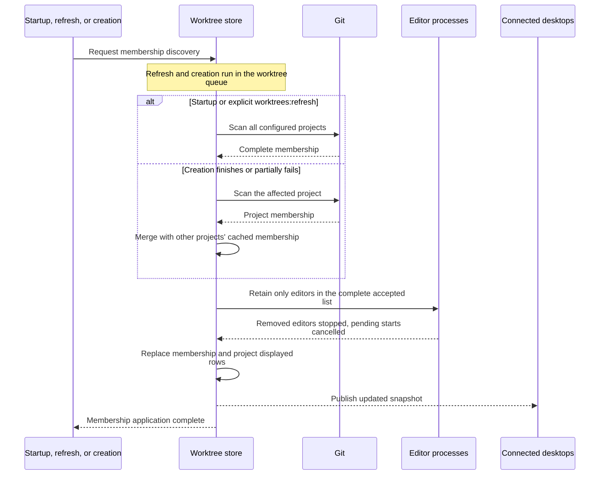
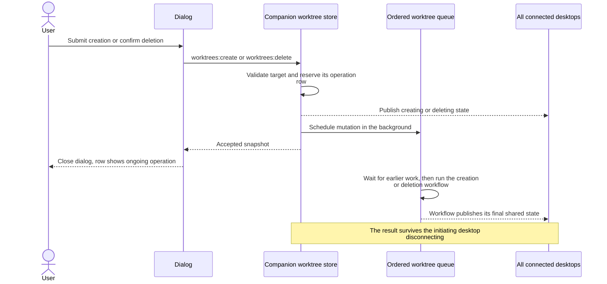
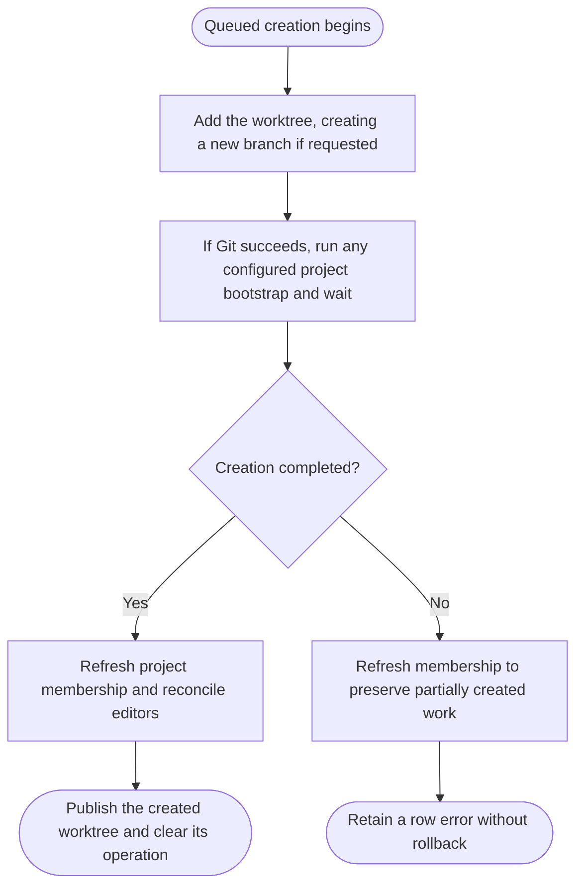
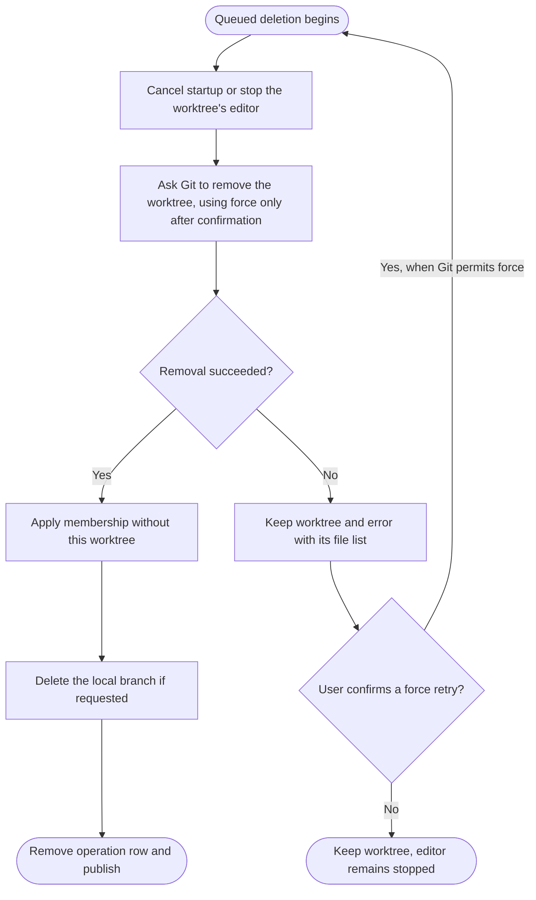
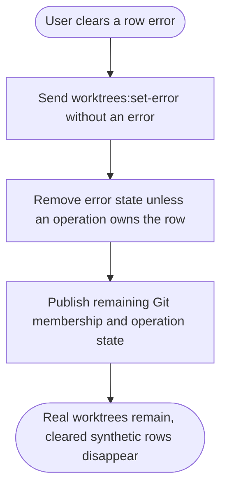

# Worktrees

- The companion caches Git membership and combines it with operation state, retained errors, and editor status. Synthetic creation rows describe pending or failed work even when Git has no worktree there.
- Mutations and refreshes run in one ordered queue across clients. Listing reads the cache without running Git; external Git changes appear after a refresh.
- The picker lists running or starting editors first, ordered by most recent pick in the current picker session. Unpicked open worktrees and unopened worktrees retain companion order within their groups. Search preserves this ordering; changes to the displayed order reset selection and scroll to the first available result.
- Presentation prioritizes an operation or opening progress, then a retained error, then editor status. Editor status events publish state without rescanning Git or reconciling membership.
- Worktree names use their assigned color while the editor is starting or running and grey when it is stopped. The companion saves a color per worktree identity in its data directory before editor startup; it survives editor stops, reconnects, and companion restarts. The picker and extension chat list use the same color. Reopening restores the saved color. New assignments favor the least-used palette color, counting saved assignments for stopped worktrees too.
- Sources: [worktree store](../src/server/worktrees/worktree-store.ts), [mutation dialogs](../src/renderer/src/components/worktree-actions.tsx).

## Refresh and apply membership



- Every accepted membership change uses the same reconciliation order, including deletion's known removal. Synthetic rows are excluded from the editor retention list.
- Desktop main [accepts newer snapshots](desktop.md#accept-shared-state) and reconciles retained pages before updating the picker.

## Autofill a creation path

```mermaid
sequenceDiagram
    actor User
    participant Dialog
    participant Companion
    User->>Dialog: Open creation
    Dialog->>Companion: Request all project path templates once
    Companion-->>Dialog: Templates, main paths, and platform path rules
    Note over Dialog: Render initial suggestion from current inputs
    User->>Dialog: Change project or branch
    alt Path autofill is enabled
        Dialog->>Dialog: Render cached template locally with current variables
        Note over Dialog: Keep the current path until rendering completes
        Dialog-->>User: Show result if input is still current
    else Path was manually edited
        Dialog-->>User: Keep the entered path
    end
    User->>Dialog: Clear the path
    Dialog->>Dialog: Leave empty; enable autofill on the next variable change
```

- The effective branch is the trimmed new branch name, falling back to the base branch. Each project may configure a Liquid path template; the default appends a filename-safe branch to the main worktree path.
- The initial template response fills the path from the current inputs unless the user has edited or cleared it. Branch edits and project changes require no additional requests or debounce; local hashing and path helpers preserve companion platform behavior.
- Suggestions do not change Git membership or reserve a destination. Manual edits (including clearing), project/branch changes, and dismissal suppress obsolete results. Clearing waits for the project or effective branch to change before rendering another suggestion. Template errors allow a manually entered path.

## Schedule a mutation



- Acceptance is separate from completion. Admission failures leave the dialog open; later execution failures belong to the shared row.
- Creation runs [create a worktree](#create-a-worktree); deletion runs [delete a worktree](#delete-a-worktree). Neither operation automatically opens an editor.

## Create a worktree



- Connected desktops [notify when creation finishes](desktop.md#notify-when-worktree-creation-finishes), after the configured bootstrap and membership refresh succeed or fail. Clicking opens the worktree if it remains available.
- Paths are on the companion machine; relative paths start at the selected project. Creation resolves physical path identity before reserving the row.
- A failing Git hook or project bootstrap can leave a real worktree. The row remains usable after the operation ends; a failure with no worktree remains as a synthetic error row.

## Delete a worktree



- Main and locked worktrees cannot be scheduled for deletion. Git can refuse removal, including when local changes make it unsafe.
- The row menu offers worktree-only deletion or deletion of both the worktree and its local branch, including unmerged commits. The menu always lists every action and disables unavailable ones: branch deletion for detached worktrees, and both deletions for main and locked worktrees. It also offers [stopping the editor](editors.md#editor-process-lifetime).
- A failed removal opens a popup for the requesting picker with changed, untracked, ignored, and submodule paths. When Git requires force, the user can confirm a retry with `--force`; cancelling preserves the worktree. Main and locked worktrees remain protected.
- Branch deletion runs only after successful removal. If it fails, membership reflects the removed worktree and a retained error explains that the branch remains.

## Clear a retained error



- Clearing an error does not rerun the failed operation. Successful editor opening also leaves retained errors in place until cleared.
